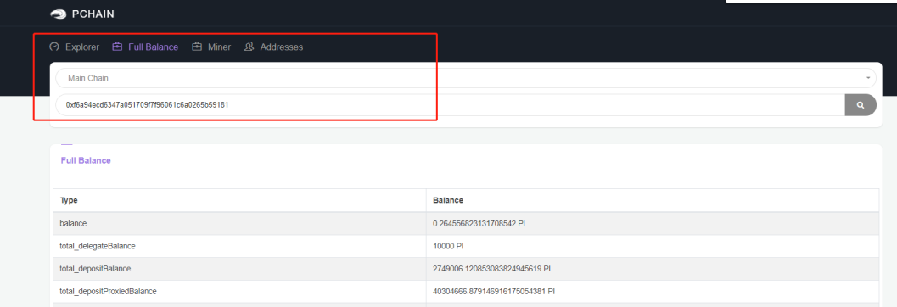
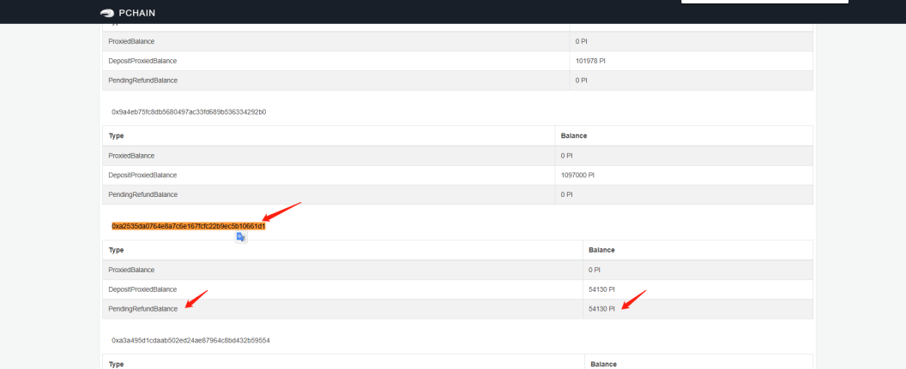

===================================
Cancel node/ Candidate / delegation
===================================

-------------------------------------------------------------
As a candidate, can I update the commission fee?
-------------------------------------------------------------
You need to cancel candidate first and then reapply candidate node (Noted that once you cancel，the delegation amount you received will return to delegators). After reapply, you can check on PIWallet if you are on the candidate list. If not, just wait for couple hours for PIWallet to refresh the commission fee.

-------------------------------------------------------------
How to cancel candidate submission?
-------------------------------------------------------------
:ref:`How to cancel candidate<cancelcandidate>`
 
-------------------------------------------------------------
How to cancel Validator node to unlock the staking amount?
-------------------------------------------------------------
After epoch reaches 75% height, you need to participate in the voting and revealing vote and set the staking amount to 0. Remember first make sure your node synced to the latest height.
The voting and revealing vote process please refer to :ref:`How to become validator by PIWallet<Wallet Validator>` and :ref:`How to become validator by RPC<Client Validator>`
Once cancellation succeed, the staking amount will be unlocked to your balance when the current epoch ends.

-------------------------------------------------------------
How to cancel delegation ?
-------------------------------------------------------------
Before the epoch reaches 75% height, you can cancel delegation. Guidance: :ref:`How to cancel delegation<canceldelegation>`

-------------------------------------------------------------
Error: cancel amount greater than your Proxied Balance
-------------------------------------------------------------

1. Mostly you have canceled this delegation before, so you will get this error when repeatly cancel it. Please make a copy of the candidate address and check its fullbalance at `PIScan <https://piscan.pchain.org/fullBalance.html>`_ . Find if your account value  show in the PendingRefundBalance in the candidate's Proxied detail. If so, the cancellation succeed, the delegated PI will unlock to your balance when the current epoch ends. 
For example, the user A (0xa2535da0764e8a7c6e167fcfc22b9ec5b10661d1 ) delegated PI to the candidate B (0xf6a94ecd6347a051709f7f96061c6a0265b59181). Once canceled, user A can find the info like below.

2.This error occured because the PI amount you are cancelling is greater than you delegated. Please copy your candidate's address and go to `PIScan <https://piscan.pchain.org/fullBalance.html>`_ to check your candidate's fullbalance. Find your address in your candidate's Proxied detail, there are 3 value which we supposed is 
::
	ProxiedBalance 	A PI
	DepositProxiedBalance 	B PI
	PendingRefundBalance 	C PI

The amount you cancel should be lower or equal than A+B-C.

-------------------------------------------------------------
Error:delegation amount must be greater or equal to 1000PI
-------------------------------------------------------------

This error occured because you are cancel invalid amount.Please copy your candidate's address and go to `PIScan <https://piscan.pchain.org/fullBalance.html>`_ to check your candidate's fullbalance. Find your address in your candidate's Proxied detail, there are 3 value which we supposed is 
::
	ProxiedBalance 	A PI
	DepositProxiedBalance 	B PI
	PendingRefundBalance 	C PI

If you don't wanna cancel all your delegation, the amount you cancel should be lower or equal than A+B-C-1000. If you wanna cancel all your delegation, the amount you cancel must be equal to A+B-C.

--------------------------------------------------------------------------
When can I get my PI back after I cancel the delegation successfully?
--------------------------------------------------------------------------
If you delegated and wanna cancel in the same epoch before the chain reaches 75% height, the token will return back to balance immediately.

If you delegated in last epoch and your candidate failed to be validator in current epoch, once you cancel delegation before the chain reaches 75% height, the token will return back to balance immedidately.

If you delegated in last epoch and your candidate is elected to be validator successfully in current epoch, once you cancel delegation before the chain reaches 75% height, the token will return back to balance when the current epoch ends.
