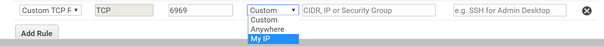
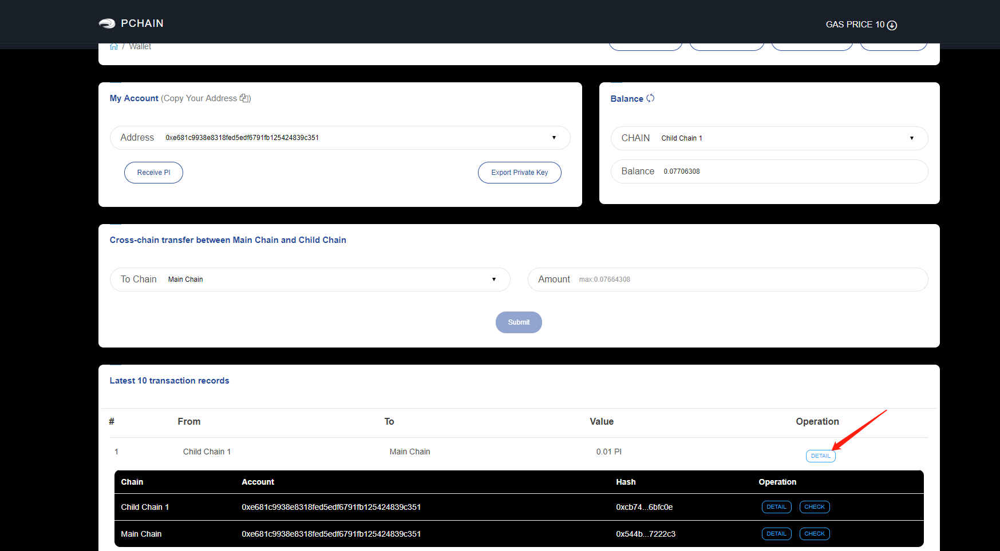
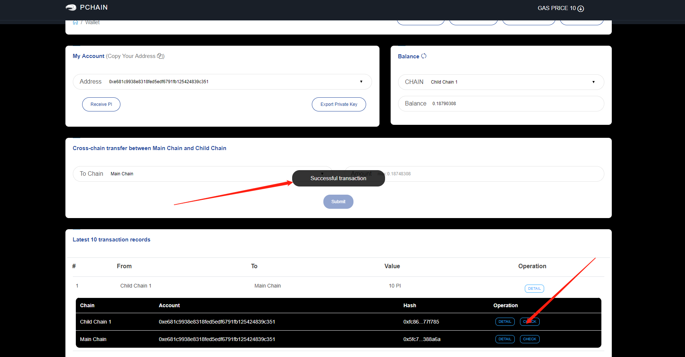
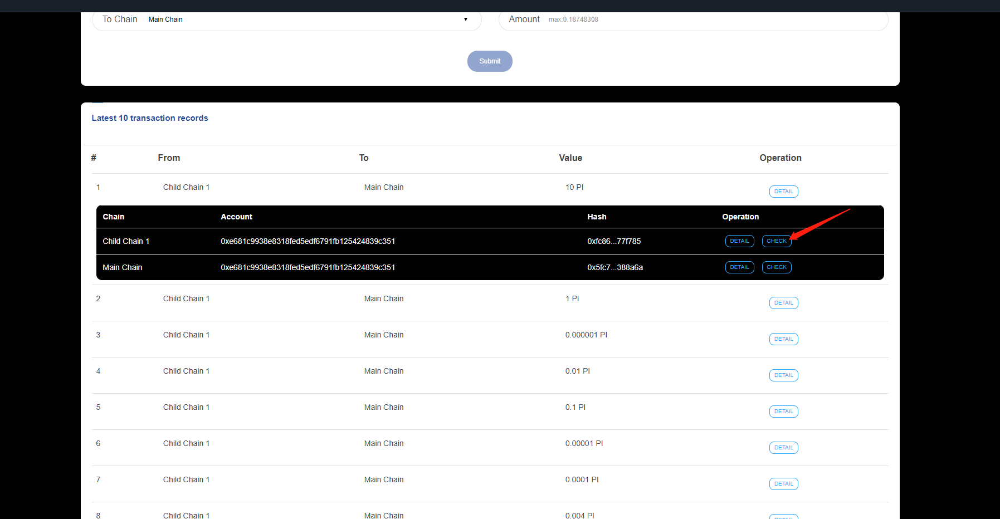
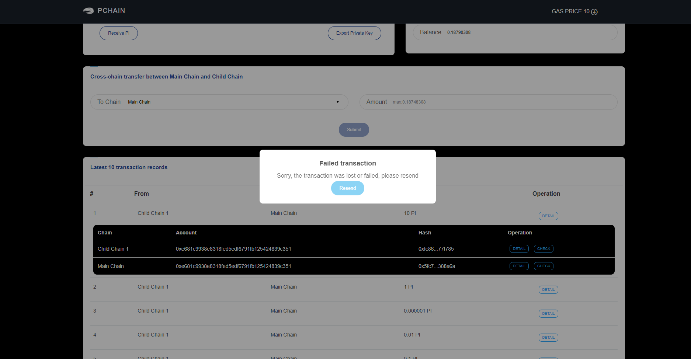
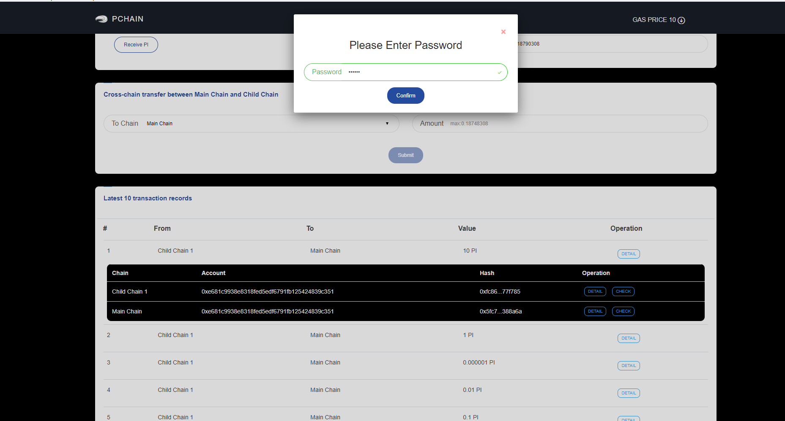
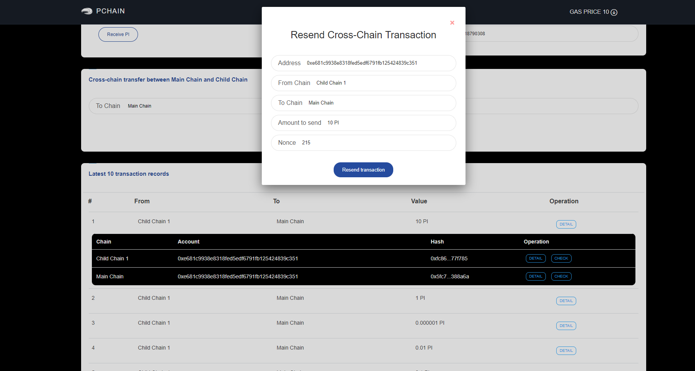
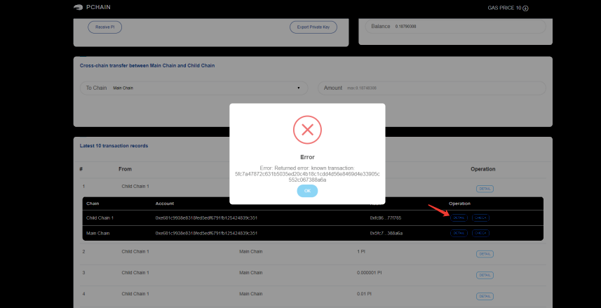

====
FAQ
====

.. toctree::
   :maxdepth: 3
   :caption: Contents:

   canceldelegation
   node
   tokenswap
   validator

-------------------------------------------------------------
How many reward will I get if I successful deposit on pchain?
-------------------------------------------------------------
Suppose your deposit amount is A, the total deposit of current epoch is B, the total block number of current block is C, the reward per block during current epoch is D, then your reward during current epoch will be about A/B*C*D.

--------------------------------------------------------
How do I know if I can be next epoch's validator or not?
--------------------------------------------------------
First of all, make sure you vote and reveal vote correctly.This can be check via tdm.getNextEpochVote() in pchain's console. If your deposit amount ranks before (number of current epoch's validator + number of next epoch's new bidders / 2 ), then you will be next epoch's validator. You can also check via tdm.getNextEpochValidators() to see if you are in the validator list.

e.g currently we have 79 validators on main chain, and we got 5 bidder now, then the threshold ranking will be 79 + 5 / 2 = 81

----------------------------------------------------
Can I run main chain and child chain on one machine?
----------------------------------------------------
Yes, currently Pchain's mainnet has one main chain and one child chain, you can run and mine both chain on one machine.

---------------------------------------------
Why can't I connect to my node from PIWallet?
---------------------------------------------
If you are trying to use "local node mode" in PIWallet and get this error:

.. image:: ../_static/q&a/walletcannotconnect.jpg

Make sure you have done things bellow:

- install and run pchain on your remote node
- run pchain with flag "--rpc --rpcaddr=0.0.0.0"
- open port 6969 to your local ip

Here is an example which run PIWallet on PC to connect to pchain running on AWS EC2:
On AWS EC2, we run pchain with this command:
::
	~/pchain/bin/pchain --datadir=~/pchain/.pchain --rpc --rpcapi=eth,web3,admin,debug,tdm,miner,personal,chain,txpool,del --childChain=child_0 --rpcaddr=0.0.0.0 
And then we open port 6969 to my PC in security group of my AWS EC2

------------------------------------------------------------
Why my PIWallet doesn't show anything under local node mode?
------------------------------------------------------------
If you are trying to use "local node mode" in PIWallet and connect to your node succesfully but can't find any information shown in PIWallet, probably because you haven't transport your keystore file to your node.
If you wanna send any transactions by PIWallet local node mode, you should keep your keystore file under "yourdatadir/.pchain/chainid/keystore/". So the structure of your datadir should look like this:
::
	datadir/
		-chaininfo.db/    
		-config.toml  
		-nodekey    
		-nodes/    
		-tx3cache/
		-pchain/
			-data/  
			-geth/  
			-pchain.ipc
			-priv_validator.json  
			-keystore/   //you should put your keystore file under here
		-child_0/
			-data/  
			-geth/  
			-pchain.ipc
			-priv_validator.json 
			-keystore/	 //you should put your keystore file under here

------------------------------------------------------------
How to check if my node running correctly?
------------------------------------------------------------
First, check if you are running the latest version, you can find the latest verison from our `github <https://github.com/pchain-org/pchain>`_. Then make sure the peers connected to your node is more than 2/3 validator number by RPC. And also check if you are syncing to the latest height, you can check the latest height on our `Monitor <https://monitor.pchain.org/>`_.

---------------------------------------------
How to migrate my pchain to another computer?
---------------------------------------------
If you wanna migrate your pchain to another computer, just install pchain on your new computer, and copy priv_validator.json and nodekey to your new computer.

----------------------------------------------------------------------
As validator, should I do the vote and the reveal vote for each epoch?
----------------------------------------------------------------------
If you wanna keep the same deposit amount in next epoch, you don't need to proceed it again. Otherwise you should participate in this process.

| e.g your current deposit amount is A
|     the deposit amount you wanna add is B
|     then you should set the amount to A+B during vote and reveal vote

-------------------------------------------------------------------------
What should I do if I wanna change my commission fee if I am a candidate?
--------------------------------------------------------------------------

 You need to cancel candidate and apply candidate on chain again(remember once you cancel your proxied amount will be return to delegators). And if you can cancel and apply on chain again very quickly, you may dont need to apply on website. After done things on chain you can check on PIWallet if you are still on the candidate list, if not please apply on website again, if you are still on, just wait for couple hours for PIWallet to refresh the commission fee.

-------------------------------------------------------------------------
What should I do if I accidently transfer ERC20 PI to native PI address?
-------------------------------------------------------------------------
please follow this `video <https://www.youtube.com/watch?v=TRHv0sNS37U>`_.

--------------------------------------------------
How to recover abnormal cross-chain transaction?
--------------------------------------------------

Because of the consensus network, some people may get issue on cross-chain transaction that the balance didn’t increase after at least 5 minutes. Here are the detailed operation to help you make the transaction successful.

Open PIWallet, go to “ Wallet ” tab, find the transaction record and click “detail”.

- Situation1
Click “Check ”, if it returns “Successful transaction” on the page, it means this transaction is successful now. You can refresh the balance on main chain again. 

 
- Situation 2
If you click “check” and it returns “Failed Transaction”, it means you need to resend PI to recover this transaction. Pls click “Resend” directly.

Fill out your account’s password.

Confirm the transaction info and click “Resend transaction”.

If it returns with one transaction hash, it means resend successfully. You can check the balance within 2 minutes.
If it returns “Error” like the picture below, pls click “Detail” of the first transaction record and make a copy of the transaction hash. Then send this Tx hash & your address to PCHAIN Team (op@pchain.org). PCHAIN team will help you make this transaction successful in 1~2 business day(s). 

