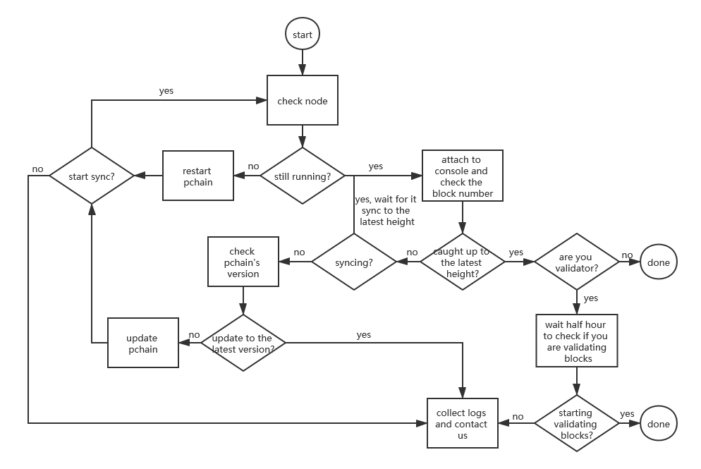

==============================
Check node status step by step
==============================

-------------------------------------------------------------
1.How to check if your node is still running?
-------------------------------------------------------------

Attach to your server, and run command
::
	ps ax|grep pchain

if it returns a string such as
::
	 6931 pts/0    Rl     0:01 /home/ubuntu/pchain/bin/pchain --datadir=~/pchain/.pchain --rpc --rpcapi=eth,web3,admin,tdm,miner,personal,chain,txpool,del --gcmode=archive --verbosity=0 --prune

your pchain is still running. If not, please run
::
	sudo ./pchain/run.sh

-------------------------------------------------------------
2.How to check if your node is caught up to the latest block?
-------------------------------------------------------------

if you wanna check main chain:
::
	cd ~/pchain
	sudo ./bin/pchain attach .pchain/pchain/pchain.ipc
	pi.blockNumber

if you wanna check child chain:
::
	cd ~/pchain
	sudo ./bin/pchain attach .pchain/child_0/pchain.ipc
	pi.blockNumber
it will return the latest block on your node, and then to check if the height is same as our `Monitor <https://monitor.pchain.org>`_.

-------------------------------------------------------------
3.How to check pchain's version?
-------------------------------------------------------------

::
	cd ~/pchain
	./bin/pchain version
it will return the version of pchain, you can check the latest version on our `github <https://github.com/pchain-org/pchain/releases>`_.

Note: if the version of pchain is different from the version in file "~/pchain/version", plz delete the file, the auto-update script will update pchain 10 mins later.

-------------------------------------------------------------
4.How to check if your node is syncing?
-------------------------------------------------------------
if you wanna check main chain:
::
	cd ~/pchain
	sudo ./bin/pchain attach .pchain/pchain/pchain.ipc
	pi.syncing

if you wanna check child chain:
::
	cd ~/pchain
	sudo ./bin/pchain attach .pchain/child_0/pchain.ipc
	pi.syncing

if it return true, your node is syncing now. Also you can type "pi.blockNumber" every min to check if the height is growing continiously. If so, your node is syncing.

-------------------------------------------------------------
5.How to check if my node is validating blocks?
-------------------------------------------------------------

| Go to `piscan <https://piscan.pchain.org/miner.html>`_, enter your address and search, you can check the last block you validated. Usually the last block you validate should be several mins ago. 

-------------------------------------------------------------
6.How to collect logs?
-------------------------------------------------------------

Set verbosity=3 in file "run.sh" and restart pchain, there will be a "log" folder under the same directory you run the "run.sh".

-------------------------------------------------------------
7. What’s the equipment requirement to run a node on PCHAIN ?
-------------------------------------------------------------
:ref:`Server Requirement<Requirement>`

-------------------------------------------------------------
8. Can I run main chain and child chain on one machine ?
-------------------------------------------------------------
Yes, currently Pchain’s mainnet has one main chain and one child chain, you can run and mine both chains on one machine.

-------------------------------------------------------------
9. How to migrate my pchain to another computer?
-------------------------------------------------------------
If you wanna migrate your pchain to another computer, just install pchain on your new computer, and copy priv_validator.json and nodekey to your new computer.

------------------------------------------------------------------------
10. How to check if my node running correctly after setting up the node?
------------------------------------------------------------------------
First, check if you are running the latest version, you can find the latest verison from our github. Then make sure the peers connected to your node is more than 2/3 validator number by RPC. And also check if you are syncing to the latest height, you can check the latest height on our Monitor.

-------------------------------------------------------------
11. How to check your node status when running on PCHAIN?
-------------------------------------------------------------
:ref:`Flow and FAQ of become validatorFaqvalidator<>`

-------------------------------------------------------------
12. How many tokens to run on PCHAIN?
-------------------------------------------------------------
You need stake at least 100K PI to run on PCHAIN. 
If you want to run a node through others’ delegation, then you need 10K PI to apply for the Candidate first.

-------------------------------------------------------------
13. How to resync pchain?
-------------------------------------------------------------
If you run into bad block issue, you should re-sync pchain from block 0.

First, delete the data except your priv_validator.json and nodekey, after delete, your datadir should look like this:
::
	datadir/
        -nodekey
        -pchain/
                -priv_validator.json  
                -keystore/
If you are running child chain, your datadir should look like this:
::
	datadir/
        -nodekey
        -pchain/
                -priv_validator.json  
                -keystore/
        -child_0/
        		-priv_validator.json
        		-genesis.json
        		-eth_genesis.json
        		-keystore/
Make sure your datadir is excactly like above. Now you can re-sync blocks, if you are running child_0, remember init child chain first:
::
	cd ~/pchain
	./bin/pchain --datadir=~/pchain/.pchain init ~/pchain/.pchain/child_0/eth_genesis.json child_0
	./run.sh
If you run main chain only, just run
::
	cd ~/pchain
	./run.sh

-------------------------------------------------------------
14. What should I do if I got bad block very often?
-------------------------------------------------------------
We recommend you re-sync from our bootnodes, here are the ips of bootnodes:
::
	13.53.189.137
	13.234.151.146
	35.165.181.32
open your port 30308 only to these 3 ips, after synced to the latest height, you can open port 30308 to other ips.