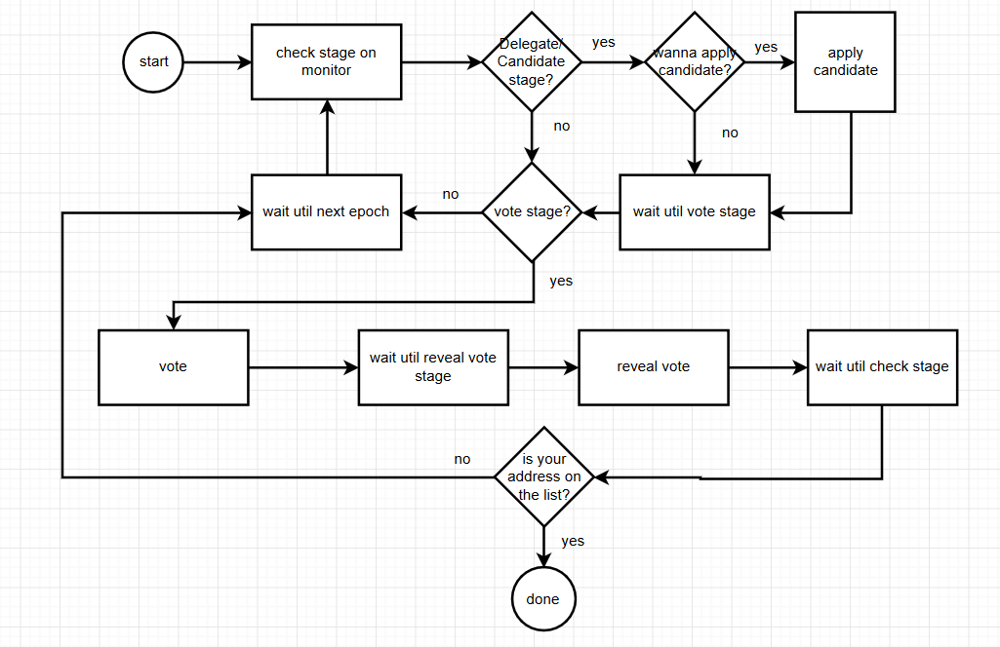

.. _Faqvalidator:

================================
Flow and FAQ of become validator
================================

For more information please refers to :ref:`How to become validator by PIWallet <Wallet Validator>` and :ref:`How to become validator by RPC <Client Validator>`. There are some FAQ below:

---------------------------------------------------------------------
1. Where to find the exact time to participate in staking correctly?
---------------------------------------------------------------------

You can check stage on our `Monitor <https://monitor.pchain.org>`_. There are four stage in one epoch.

+------------+--------------------------------------+------------------------------+
| Stage      | Block Number                         | What you can do              | 
+============+======================================+==============================+
| 0% ~ 75%   | start_block ~ vote_start_block - 1   | apply candidates and delegate| 
+------------+--------------------------------------+------------------------------+
| 75% ~ 85%  | vote_start_block ~ vote_end_block    | vote                         |
+------------+--------------------------------------+------------------------------+
| 85% ~ 95%  | reveal_start_block ~ reveal_end_block| reveal vote                  |
+------------+--------------------------------------+------------------------------+
| 95% ~ 100% | reveal_end_block + 1 ~ end_block     | check next epoch's info      |
+------------+--------------------------------------+------------------------------+

-------------------------------------------------------------
2. The detailed operation to become validator via PIwallet
-------------------------------------------------------------
:ref:`How to become validator by PIWallet <Wallet Validator>`

-------------------------------------------------------------
3. The detailed operation to become validator via RPC
-------------------------------------------------------------
:ref:`How to become validator by RPC <Client Validator>`

-------------------------------------------------------------
4.Must I apply candidate?
-------------------------------------------------------------

No, you can compete validator by yourself. But if you apply candidate, you can get other's deposit, which will make you more competitive.

-------------------------------------------------------------
5.How many PI should I deposit while vote stage?
-------------------------------------------------------------

The amount you deposit should be at least 100k PI and equal or larger than total_depositProxiedBalance+total_proxiedBalance.

-------------------------------------------------------------
6.How many PI is needed to be elected?
-------------------------------------------------------------

There is no a guaranteed amount, the number of new validator is depends on how many address voted and reveal voted. If your deposit amount ranks before (number of current epoch's validator + number of next epoch's new bidders / 2 ), then you will be next epoch's validator. You can also check via tdm.getNextEpochValidators() to see if you are in the validator list.

e.g currently we have 79 validators on main chain, and we got 5 bidder now, then the threshold ranking will be 79 + 5 / 2 = 81

-------------------------------------------------------------
7.How do I know if I can be next epoch’s validator or not?
-------------------------------------------------------------
If your deposit amount ranks before (number of current epoch’s validator + number of next epoch’s new bidders / 2 ), then you will be next epoch’s validator. You can also check via tdm.getNextEpochValidators() to see if you are in the validator list.

-------------------------------------------------------------
8.What is the minimun amount should I enter when I vote?
-------------------------------------------------------------

The amount should be at least 10k PI and equal or larger than total_depositProxiedBalance+total_proxiedBalance-total_pendingRefundBalance.

------------------------------------------------------------------------
9.As validator, should I do the vote and the reveal vote for each epoch?
------------------------------------------------------------------------
If you wanna keep the same deposit amount in next epoch, you don’t need to proceed it again. Otherwise you should participate in this process.

e.g 
your current deposit amount is A
the deposit amount you wanna add is B
then you should set the amount to A+B during vote and reveal vote

-------------------------------------------------------------
10.Can I update the commission fee as a candidate?
-------------------------------------------------------------
You need to cancel candidate first and then apply candidate again(remember once you cancel，your proxied amount will be return to delegators). After applied again, you can check on PIWallet if you are on the candidate list. If not, just wait for couple hours for PIWallet to refresh the commission fee.

