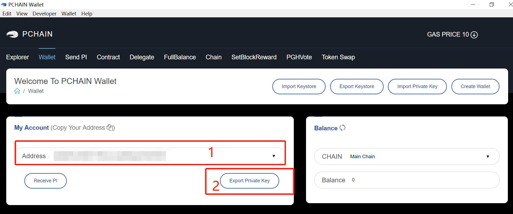

==============
FAQ（常见问题）
==============

------------------------------------------------
如何退出validator？
------------------------------------------------
确保你的节点已经同步到最新的块。退出validtaor的操作与加入validator的操作一致，当epoch进入到75%-85%时，投出amount为0的暗标，当epoch进入到85%-95%时，投出相应的明标。你的抵押金额将会在当前epoch结束后返还。
详情请参考 https://pchaindoc.readthedocs.io/en/latest/zh/pchainclient/howtobecomevalidator_zh.html 和 https://pchaindoc.readthedocs.io/en/latest/zh/wallet/localnode/Epoch_zh.html

-------------------------------------------------------------
如何取消委托 ?
-------------------------------------------------------------
Epoch进入75%之前，你都可以通过钱包取消委托。 Guidance: :ref:`How to cancel delegation<canceldelegation>`

-------------------------------------------------------------
如果我将PI抵押在了pchain上，我将获得多少收益？
-------------------------------------------------------------
你的奖励将由你抵押的金额决定。
计算公式:假设你抵押的金额为A,当前epoch总共抵押了B,你的的出块数量为C,上一个epoch的块奖励为D,则你的收益为：A / B * C * D。 

--------------------------------------------------------
怎么查看我是否成功被选为下一个epoch的validator?
--------------------------------------------------------
首先请确保自己的暗标和明标都发送成功，你可以通过tdm.getNextEpochVote()在pchain console里查看。如果你投标的金额排在了（当前epoch的validator的数量 + 新竞标者数量/2 ）之前，那么你将被选为下一个epoch的validator。在明标阶段你可以通过tdm.getNextEpochValidators()在pchain console中查看自己的地址是否在列表中。
比如：当前epoch有79个validator，并且有5个成功投标的bidder，那么你应该排在79+5/2=81名之前才能被选为下一轮的validator

----------------------------------------------------
我可以在同一台机器上跑子链和主链吗?
----------------------------------------------------
可以。

---------------------------------------------
为什么我的PIWallet连不上我的pchain节点?
---------------------------------------------
如果你在使用PIWallet的 “local node mode”时显示以下错误：

.. image:: ../_static/q&a/walletcannotconnect.jpg

请检查你是否做了下列事情:

- 你的远程机器上pchain确实正在运行中
- 你运行pchain时加上了 "--rpc --rpcaddr=0.0.0.0"这两个flag
- 你把远程机器的6969端口打开了

假设你在个人电脑上运行了PIWallet， 你想用它连接你运行在aws机器上的pchain节点，那么你运行pchain时的命令应该是这样的：

“~/pchain/bin/pchain --datadir=~/pchain/.pchain --rpc --rpcapi=eth,web3,admin,debug,tdm,miner,personal,chain,txpool,del --childChain=child_0 --rpcaddr=0.0.0.0”

在aws ec2后台上要把6969端口打开给你的本地ip：

.. image:: ../_static/q&a/open6969.jpg

------------------------------------------------------------
为什么我的PIWallet什么内容都不显示？
------------------------------------------------------------
如果你在使用PIWallet的local node mode并且已经成功连接了你的远程节点，但是钱包里没有显示任何信息，那么很有可能是因为你没有把你的keystore上传到你的远程机器上。如果你想在local node mode下发起任何交易，都需要你将keystore文件上传到你的远程节点，并放在 "yourdatadir/.pchain/chainid/keystore/"目录下。

------------------------------------------------------------
我怎么知道我的pchain节点是否在正常运行?
------------------------------------------------------------
首先，检查你是否运行了最新版本，你可以去我们的`github <https://github.com/pchain-org/pchain>`_ 查看最新版本.。然后请检查你的的节点是否连接了足够的peers，你的peers应该超过当前epoch validator个数的2/3，同时检查你的节点是否在最新的高度上，你可以通过我们的`Monitor <https://monitor.pchain.org/>`_ 查看。

---------------------------------------------
怎么把我的pchain节点迁移到另一台机器?
---------------------------------------------
如果你想把pchain迁移到另一台机器,可以直接在另一台机器上安装pchain，然后把  priv_validator.json和nodekey文件拷贝到你的新机器上即可。 

----------------------------------------------------------------------
作为一个validator，我需要在每个epoch重新投标吗？
----------------------------------------------------------------------
如果你不想改变你抵押的金额，那么在切换epoch时什么都不用做。否则你需要重新投标。

| 比如： 你当前epoch的抵押金额为 A
|       你想加仓的金额为 B
|       那你在下个epoch投标的时候应该把金额设置成A+B

-------------------------------------------------------------------------
作为一个candidate，怎么修改我设置的commission fee?
-------------------------------------------------------------------------

你需要先在链上cancel candidate然后重新apply candidate（注意一旦你cancel，抵押给你的所有PI都会回到delegator的地址上）。在链上完成以后需要在钱包里查看你是否还在candidate列表里，如果不在了，需要在网页上重新提交申请candidate的表格。

-------------------------------------------------------------------------
如果不小心把erc20PI转到了PIWallet里的地址怎么办？
-------------------------------------------------------------------------
因为PIWallet 只能对native PI进行操作，所以你需要先将该地址的私钥导出，再去erc20钱包里操作。首先请打开PIWallet进入Wallet页面，选择你的地址，然后点击Export Private Key得到该地址的私钥

 
然后用其他erc20钱包（比如MEW和ImToken等等），把私钥导入，然后把erc20转回到你原来的地址。

--------------------------------------------------
如何恢复不正常的跨链转账?
--------------------------------------------------

如果你在进行跨链转转账后的五分钟后依然没有收到PI，请根据下面的步骤操作。

打开PIWallet, 前往 “ Wallet ” 页面, 找到交易记录然后点击 “detail”.

.. image:: ../_static/q&a/recover0.png

- 情况1
点击“Check ”, 如果返回 “Successful transaction”, 说明这笔交易现在已经成功了。请再次检查你的PI余额。 

.. image:: ../_static/q&a/recover1.png
 
- 情况 2
如果你点击“check”之后得到 “Failed Transaction”的返回, 说明你需要重新发送去恢复这条交易，请点击“Resend”。

.. image:: ../_static/q&a/recover2.png

.. image:: ../_static/q&a/recover3.png

填入你的密码

.. image:: ../_static/q&a/recover4.png

确认交易信息然后点击“Resend transaction”.

.. image:: ../_static/q&a/recover5.png

如果返回了交易hash，说明resend成功了，你可以在两分钟后再次查看你的余额。

如果它返回了下图中的“Error”，请点击第一条交易记录的“Detail”并保存。将上述信息发送给我们(op@pchain.org)。我们将在1~2个工作日内会帮助你恢复这条交易。 

.. image:: ../_static/q&a/recover6.png
 

-------------------------------------------------------------
如何重新同步pchain？
-------------------------------------------------------------
如果你遇到了badblock的问题, 你需要重新同步块.

首先把除了priv_validator.json和nodekey之外的文件都删掉,删除之后你的datadir应该是这样的结构:
::
	datadir/
        -nodekey
        -pchain/
                -priv_validator.json  
                -keystore/
如果你同时还在跑子链，你的datadir应该时这样的结构:
::
	datadir/
        -nodekey
        -pchain/
                -priv_validator.json  
                -keystore/
        -child_0/
        		-priv_validator.json
        		-genesis.json
        		-eth_genesis.json
        		-keystore/
确保你的目录结构如上所示以后，可以开始重新同步，如果你跑了子链，记得先初始化:
::
	cd ~/pchain
	./bin/pchain --datadir=~/pchain/.pchain init ~/pchain/.pchain/child_0/eth_genesis.json child_0
	./run.sh
如果你只跑了主链，直接运行run.sh即可
::
	cd ~/pchain
	./run.sh

-------------------------------------------------------------
如果总是遇到bad block的问题该怎么办？
-------------------------------------------------------------
我们建议你从我们的bootnode同步数据, 以下是我们bootnode的ip:
::
	13.53.189.137
	13.234.151.146
	35.165.181.32
请只把你的30308端口开放给这三个ip, 等到同步至最新高度时, 再重新开放30308端口给其他所有ip。