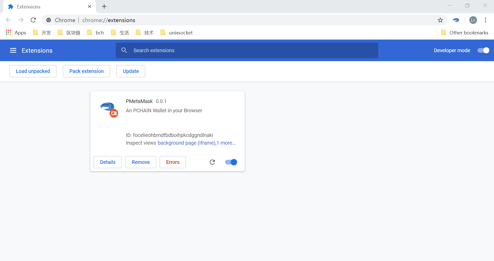
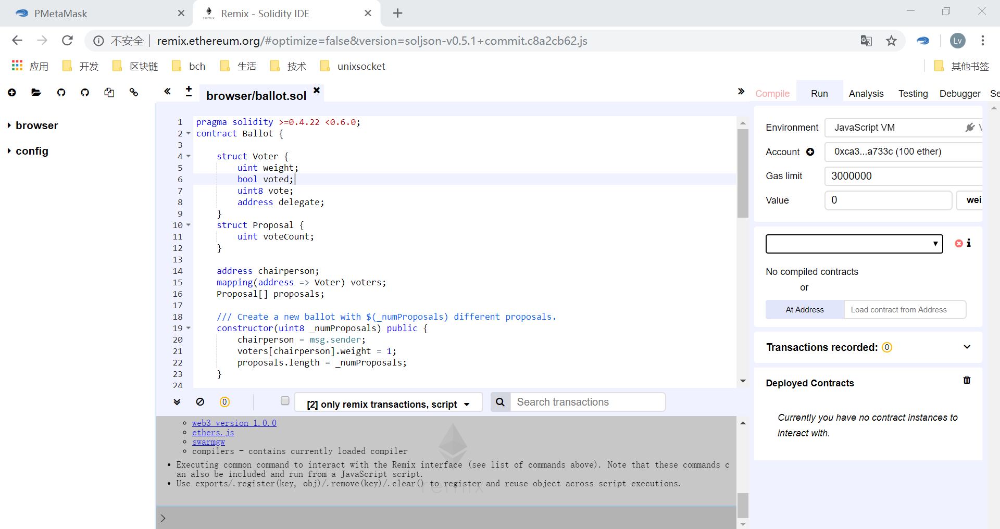
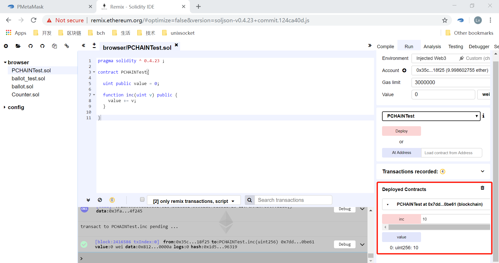

===============
PMetamask
===============
PMetamask is a plug-in wallet.

------------
Installation
------------
First, download PMetamask installation package from `here <https://github.com/pchain-org/pmetamask/releases/download/v0.0.1/Pmetamask-chrome-0.0.1.zip>`_.
Then open Chrome and input chrome://extensions/ to enter extensions page:

.. image:: ../_static/pmatemask/chromeextension.png

Switch to Developer mode on top right of the explorer and drag the PMetamask installation package into it to install the plug-in.

After create or import address by following the guide of PMetamask，you can see something look like this:

.. image:: ../_static/pmatemask/pmetamaskehello.png

PCHAIN’s smart contract can only be deployed on child chain. We choose the child chain 1 on PCHAIN testnet to deploy smart contract. You can get free tPI on this child chain from `here <https://testnet.pchain.org/vfaucet.html>`_.

.. image:: ../_static/pmatemask/choosenetwork.png

-------------------------------
Connect Remix and PMetamask
-------------------------------
Keep PMetamask opening，open Remix【http://remix.ethereum.org】 the page is look like this：

Under Remix’s ‘Run’ menu，select the Environment as ‘Injected Web3’:

.. image:: ../_static/pmatemask/selectenv.png

Click ‘connect’ on the popup PMetamask Notification dialog

.. image:: ../_static/pmatemask/connecttometamask.png

After that，the default account’s address in PMetamask will shown in ‘Account’ field automatically.

.. image:: ../_static/pmatemask/shownaddress.png

-----------------------------------------
Deploy and interact with smart contract
-----------------------------------------
Edit smart contract in Remix，e.g：
::
	pragma solidity ^ 0.4.23 ;
	contract PCHAINTest{
	    
	  uint public value = 0;
	  function inc(uint v) public {
	    value += v;
	  }
	}

select the proper version to compile（here we take version 0.4.23 as an example）：

.. image:: ../_static/pmatemask/selectversion.png

compile smart contract

.. image:: ../_static/pmatemask/compile.png

Click the ‘Deploy’ button under ‘Run’ menu to deploy the smart contract just complied

.. image:: ../_static/pmatemask/deploy.png

After click the ‘deploy’ button，click the ‘confirm’ button on PMetamask Notification dialog：

.. image:: ../_static/pmatemask/confirm.png

After deployed successfully, you can debug the contract

.. image:: ../_static/pmatemask/interact1.png

| If there are operations need to spend Gas,  you may need confirm in the pop-up PMetamask dialog or in PMetamask directly. 
| If the transaction failed, you can try to resend it or change the gas fee according to the returned error. 

