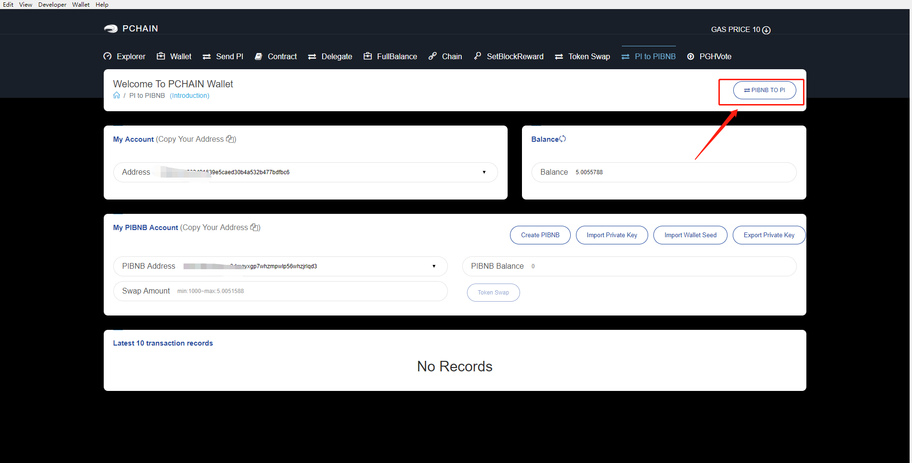
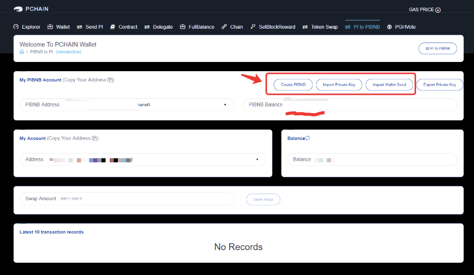
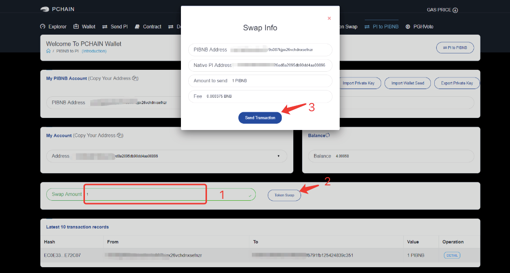
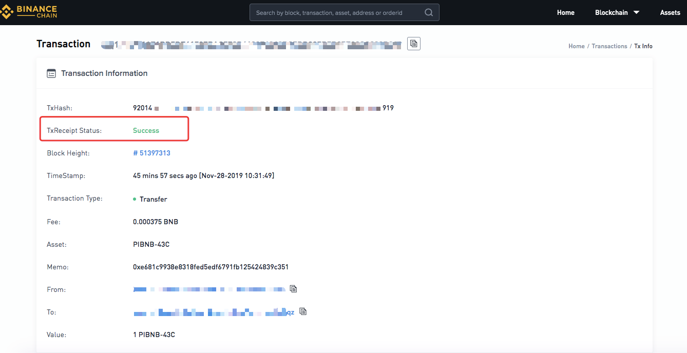
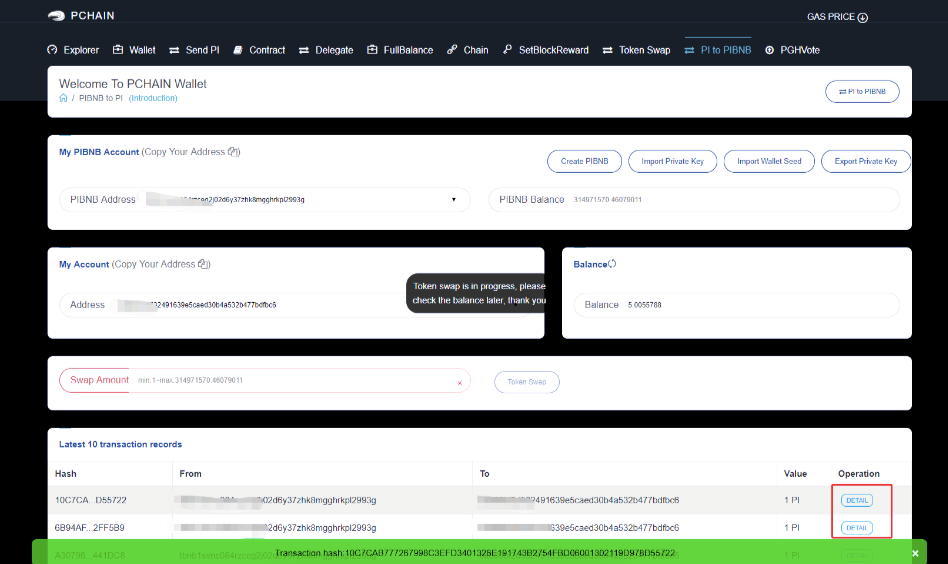

=============================
PIBNB to Native PI Token Swap
=============================

Reminders before you start swap on PIwallet.

1. Update PCHAIN Wallet to the latest version. Click here to download PIwallet.
2. Ensure that you keep the private key or wallet seed of the PIBNB address well.
3. Ensure there is a minimum amount of BNB (~ 0.000375 BNB ) in your PIBNB address to cover the BNB fee.
4. After you send the swap transaction, you will receive your native PI within 2 business days at most, but the process will be finished in around 2 mins usually.

Step1:  Go to‘PI to PIBNB’page and click the ‘PIBNB to PI ’. 

Step2: Import PIBNB address via importing wallet seed/ private key. You will see the PIBNB balance there. 
Also, you can create new PIBNB address here and transfer PIBNB to this new one. 

Step3: Elect and confirm your native PI address. The default native PI address below is the latest one you created under ‘Wallet’ page. If you want to create new one, please go to ‘Wallet’ page again.

Step4: Enter the amount that you want to swap. Then Click ‘Token Swap’ . Enter the password of the PIBNB address and click ‘Confirm’ to continue. Please ensure there is enough BNB in your PIBNB address to cover BNB fee.

Confirm the swap info. Then click ‘Send Transaction’. It will go to Binance explorer website automatically, and please be patient to wait for the transaction to succeed.

