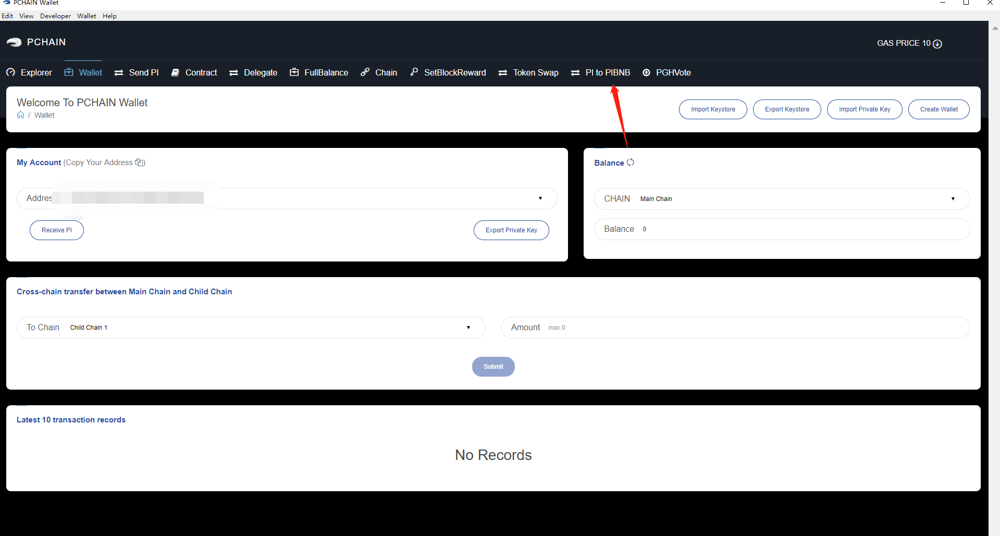
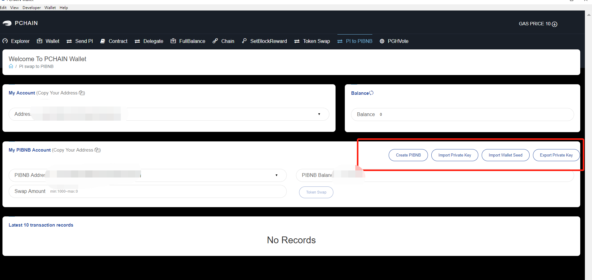
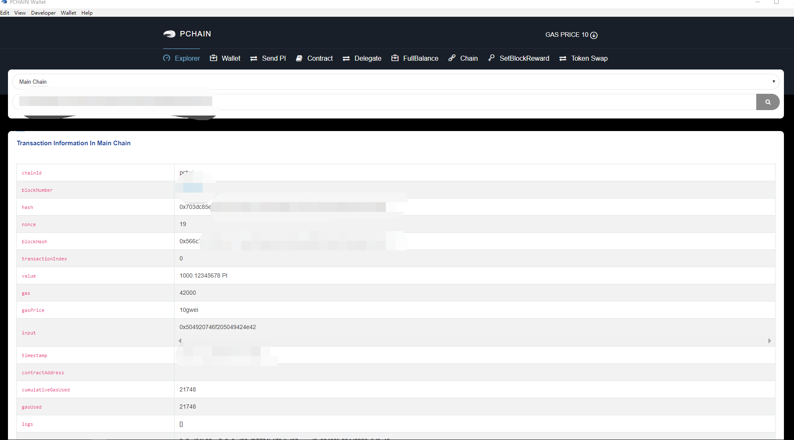
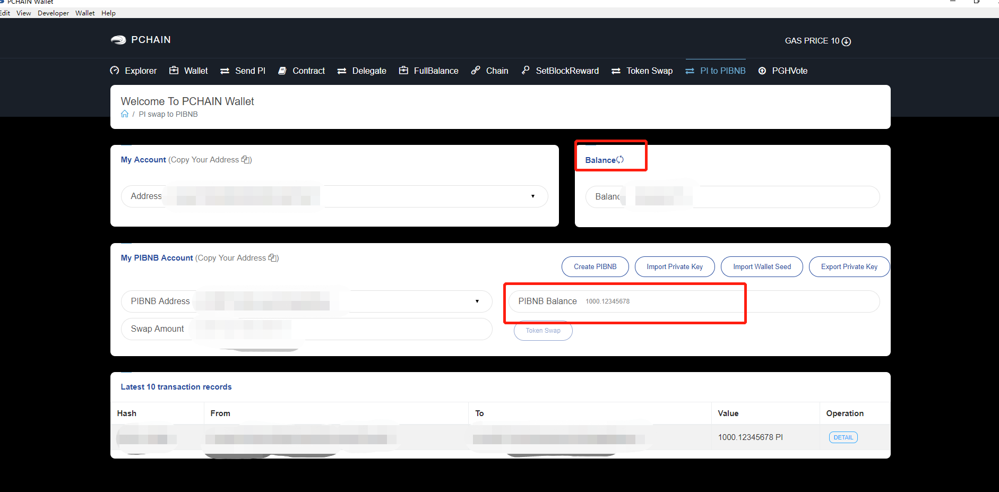

.. _PI to PIBNB Token Swap:

=============================
Native PI to PIBNB Token Swap
=============================

Reminders before you start swap PI to PIBNB on PIwallet.

1. Update PCHAIN Wallet to the latest version 1.0.5. Click `here <https://github.com/pchain-org/wallet/releases/v1.0.4>`_ to download PIWallet.
2. Ensure that you keep the private key or keystore file or the mnemonic word of the BNB address well.
3. The minimun PI swap amount is 1000PI/time and the commission fee of swap is 25PI/time, you should also have minimun of 0.0005PI left for transaction gas.
4. After you send the swap transaction, you will receive your PIBNB within **2 business days** at most, but the process will finished in several mins usually.

Step 1: Open the PIwallet and click ‘PI to PIBNB’ tab.

Step 2: Create or import your BNB address to PIWallet.

You can import your BNB address by private key or wallet seed(mnemonic words) or you can just create a new address. We will take 'create PIBNB' as an example.

Click ‘Create PIBNB ’, copy the wallet seed(mnemonic words). Set password and repeat it. Then click ‘Create’ to confirm. 

| Noticed: Please keep the mnemonic words and password well by yourself.   

.. image:: ../_static/pitopibnb/2.jpg

After create or import your PIBNB address and PIBNB balance will show in 'My PIBNB Account'.

Step 3: Swap native PI to PIBNB

Choose your native PI address, ensure the amount is larger than 1000PI. Choose your PIBNB address, fill the amount you wanna swap, and click 'token swap'.

| Notice: the amount you fill in should larger than 1000 and can't have more than eight decimal places.

.. image:: ../_static/pitopibnb/3.jpg

Step 5: Check your balance.

After transaction finished, wait several mins and click the refresh icon to check your PIBNB balance.

