.. _AWS:

============================
Install From AWS Marketplace
============================

Pchain is listing on AWS Marketplace, you can subscribe from `AWS Marketplace <https://aws.amazon.com/marketplace/pp/B07VNFPPXZ>`_. Please follow the step:

Click Continue to Subscribe:

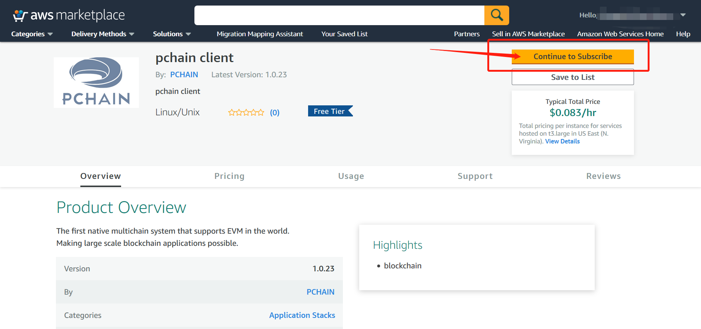

Click Accept Terms:

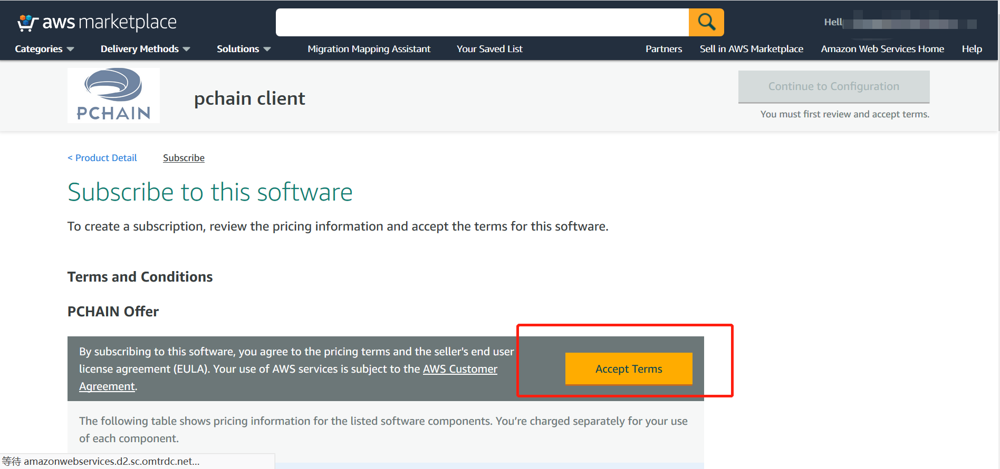

Click Continue to Configuration:

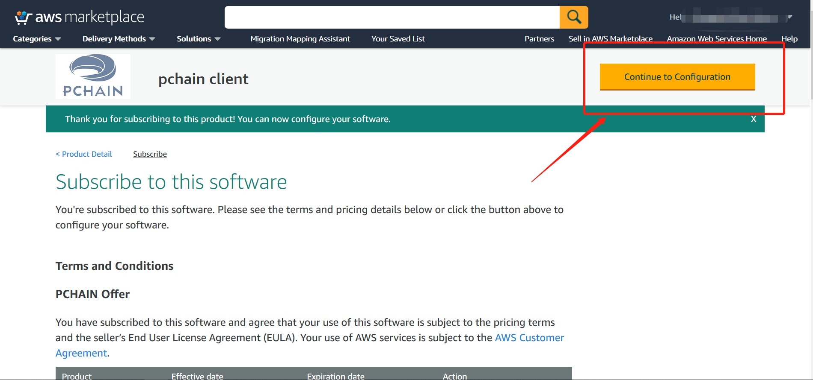

We recommend US West(Oregon) region, and clean Continue to Launch:

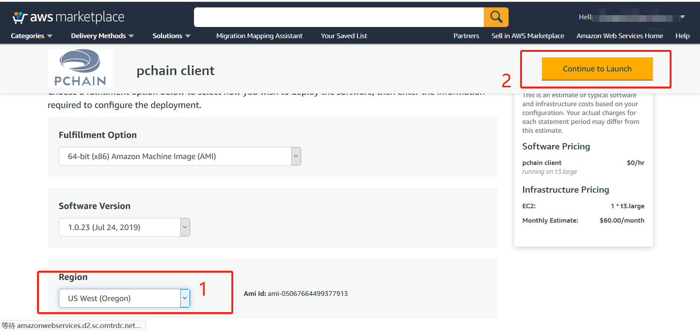

We recommend t3.large:

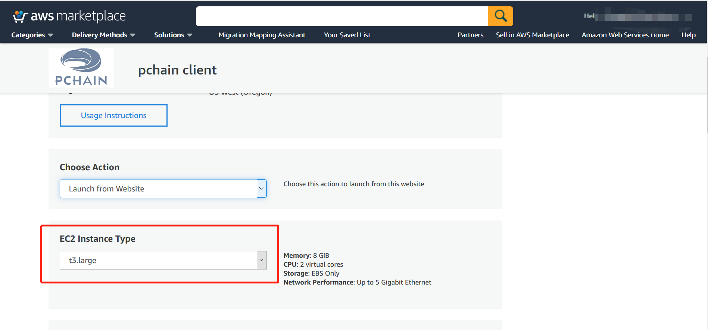

And click Create New Based On Seller Settings:

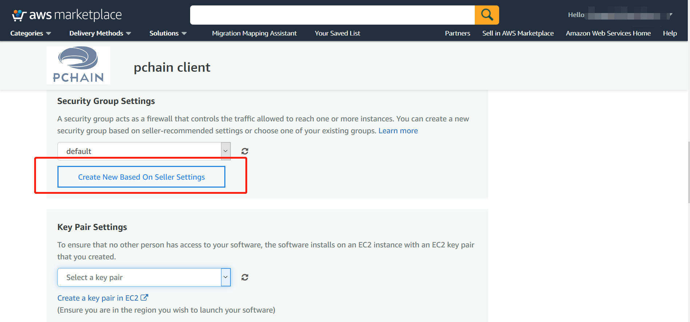

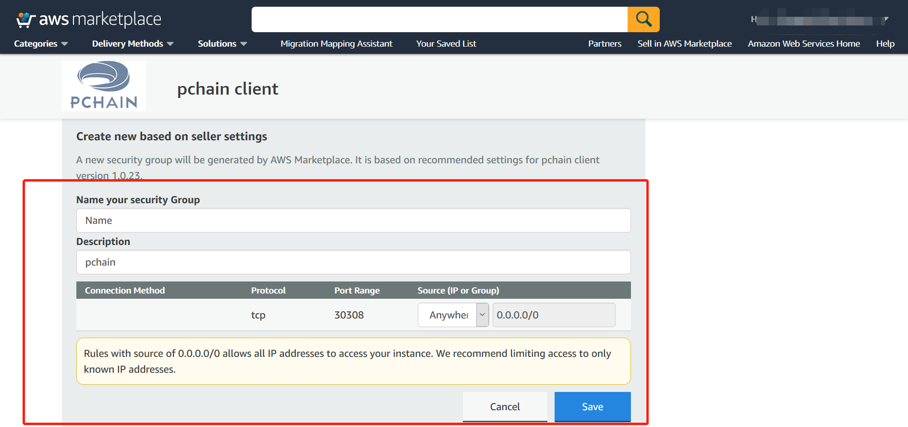

After launch, you can go to EC2 console:

.. image:: ../_static/aws/7.png

And edit the security group:

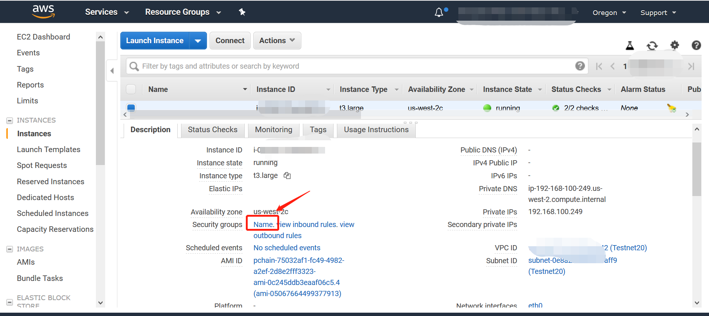

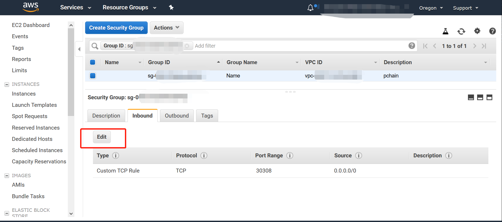

Open port 6969 and 22 to your local ip:

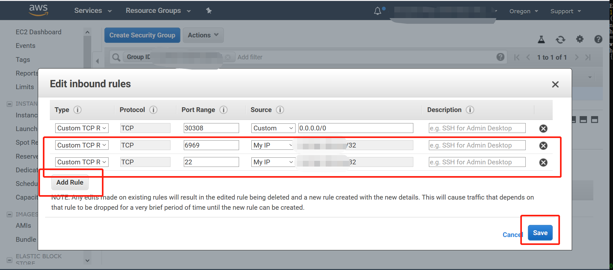

Attach to your aws ec2, run command
::	
	cd pchain
	./run.sh
	./bin/pchain attach .pchain/pchain/pchain.ipc

and check eth.blockNumber to see if the height changes continiously.

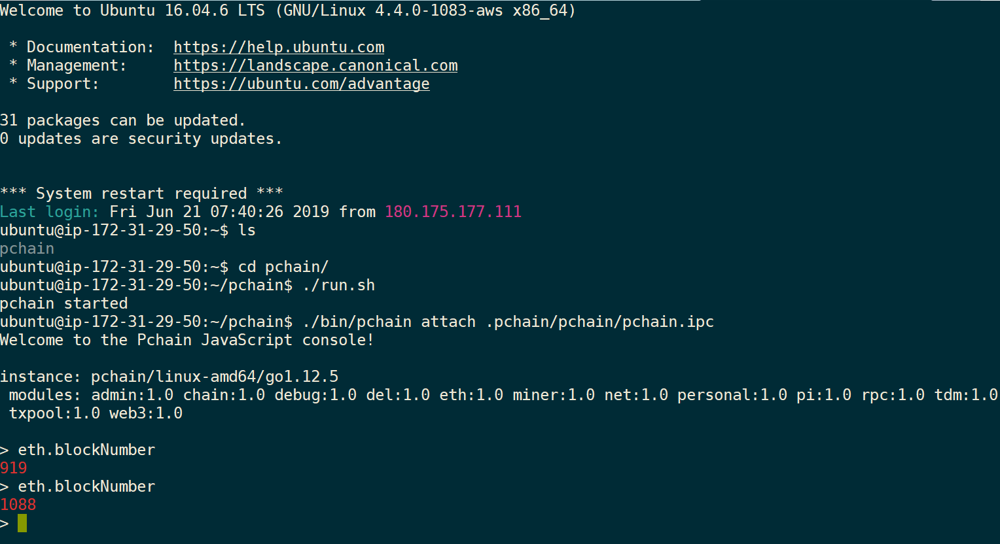

After that, exit console and set up the crontab by command "sudo crontab -u ubuntu scripts/pchain.cron", and run "crontab -l" to check.

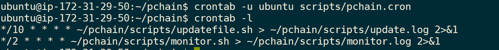

Now you can go :ref:`Create Your Account`.
