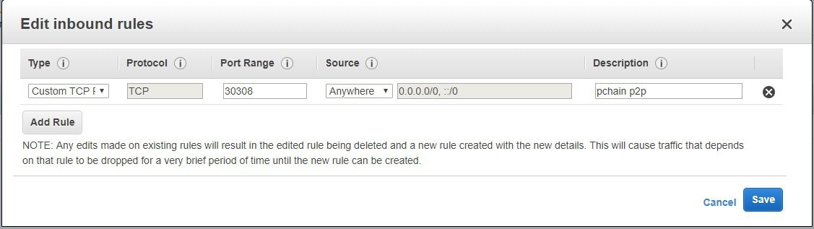

.. _Requirement:

==================
System Requirement
==================

Here is details of the recommended system requirements of Validator as below.

According to the current cost of AWS, the total cost is estimated to be around $77 for the first month. And it will be increased probably during the following months based on the actual use.
1 . EC2 Rental Fee (US West 2 price depends on demand)

+--------------+-------+--------+------------------------+
|              | vCPU  | Memory |   Monthly fee          | 
+==============+=======+========+========================+
| t3.large     | 2     | 8GiB   | $62.4                  |
+--------------+-------+--------+------------------------+

2. EBS Rental Fee (US West 2 price depends on actual use)

+--------------+------------+----------------------------+------------------------+--------------------+
|              | 1GB-month  | Estimated monthly usage    |   Monthly fee          |Recommended capacity|
+==============+============+============================+========================+====================+
| SSD GP2      | $0.1       | Growing by 100GB per month |Growing by $10 per month|    2TB             |
+--------------+------------+----------------------------+------------------------+--------------------+

3. Network Bandwidth Fee (US West 2 price depends on actual use)

+--------------------+--------------------+----------------------------+-----------+--------------------+
|                    | GB                 | Estimated monthly usage    |Monthly fee| Internet speed     |
+====================+======================+==========================+===========+====================+
| AWS EC2 to internet|$0.02, first GB free| 50GB                       |$4.41      |    5Gbps           |
+--------------------+--------------------+----------------------------+-----------+--------------------+

4. Operating System

Recommend Ubuntu 18.04

----------------
Open Port 30308
----------------

Ensure that you have open 30308 port for both TCP and UDP on your server firewall so pchain's other peers can connect to your node. Here is the example of AWS.

