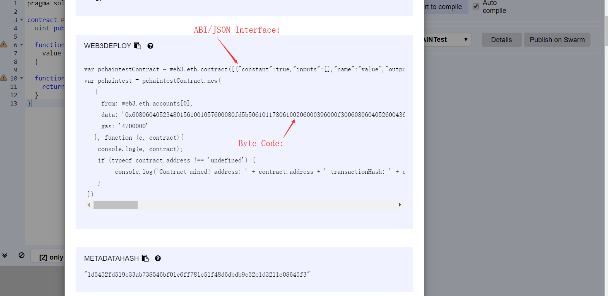
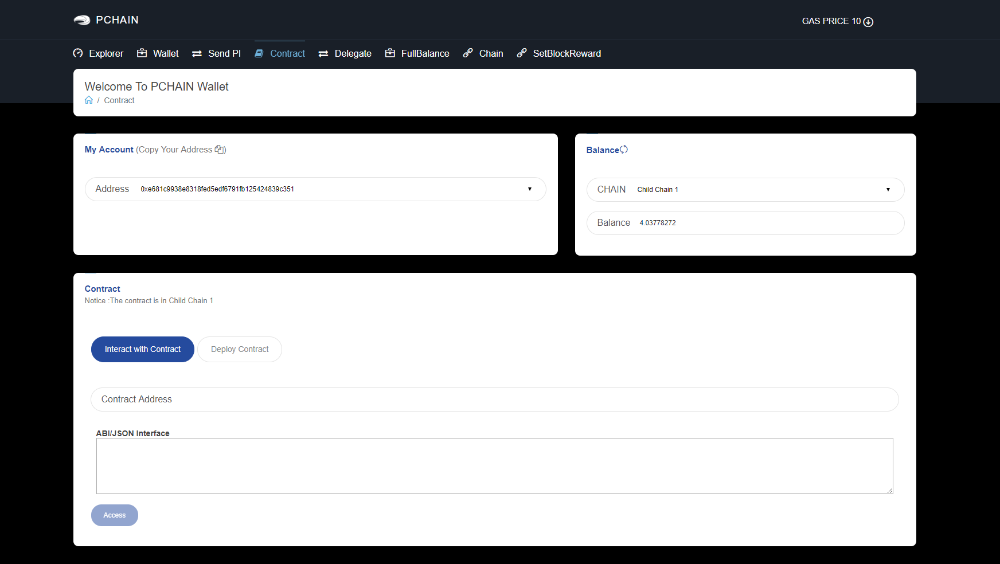
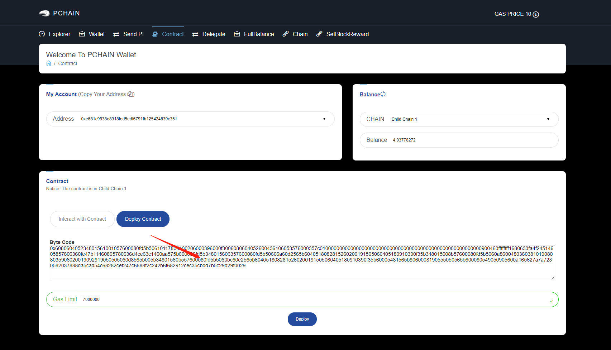

================================
How to deploy contract on pchain
================================

.. toctree::
   :maxdepth: 2

We recommand use `online compiler <https://ethereum.github.io/browser-solidity/#optimize=false&version=soljson-v0.5.7+commit.6da8b019.js>`_ to compile smart contract.

-------
Compile
-------

Copy your code into it.

.. image:: ../_static/contract/contract.png

Click **Details** button.

.. image:: ../_static/contract/compile.png

Copy the Byte Code and ABI/JSON Interface

-------
Deploy
-------

Go to contract page

Copy your byte code and click **Deploy Contract** button.

Enter your password and send the transaction.

.. image:: ../_static/contract/maketransaction.png

Wait for the contract address return and copy the address.

.. image:: ../_static/contract/address.png

----------------------
Interact with Contract
----------------------

Click **Interact with Contract** button, copy your ABI/JSON Interface into it and click **Access** button.

.. image:: ../_static/contract/abi.png

