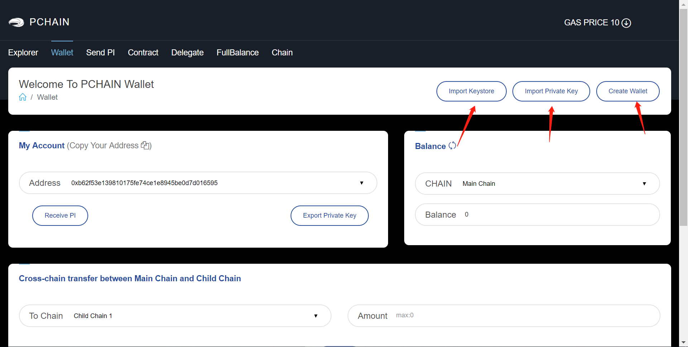
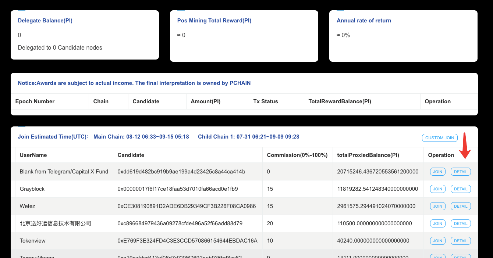
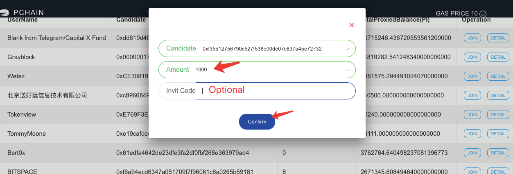
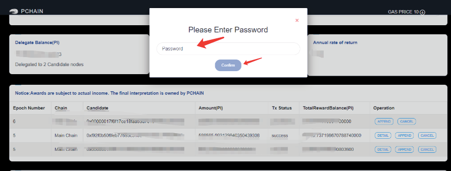
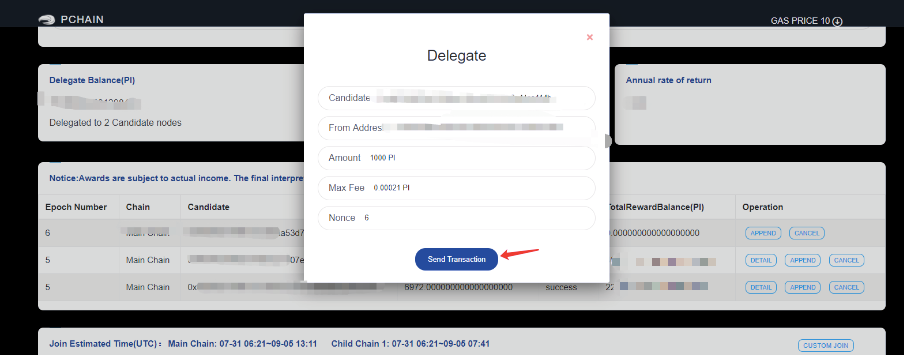
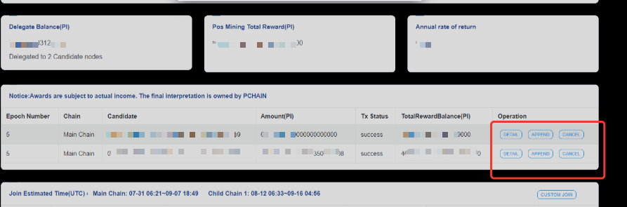
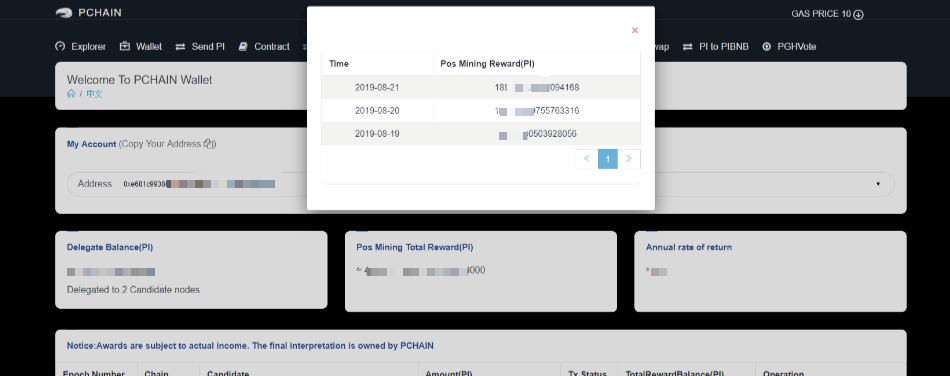
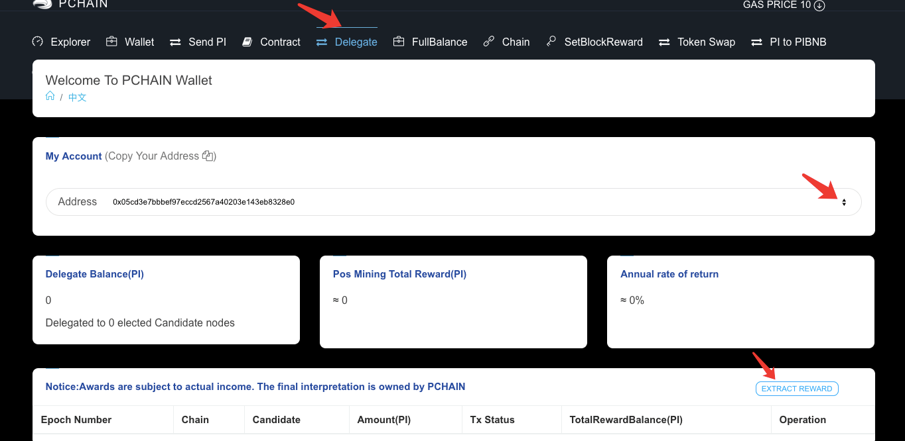
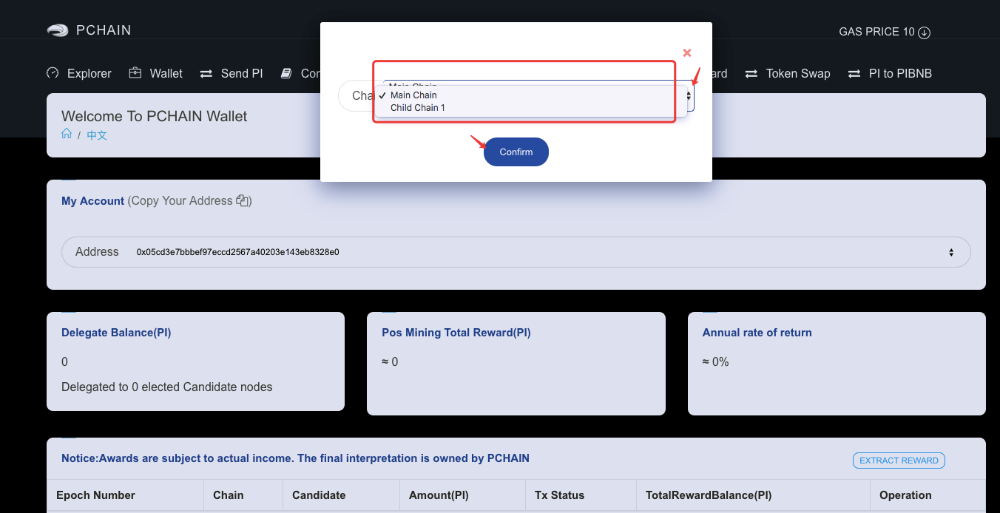
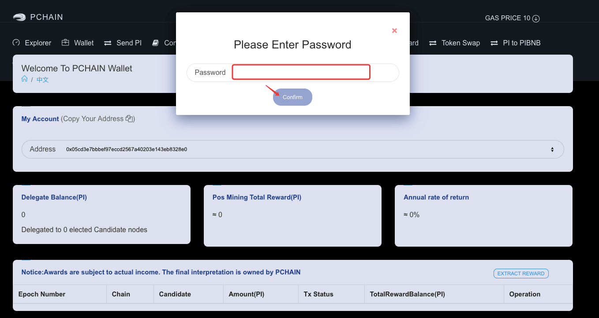

Light Wallet Mode
=================

In light mode, you can transfer PI, deploy contract and delegate on our mainnet.

.. _Create or import account:

========================
Create or import account
========================

| If you don't have an account, click the ‘Wallet--Create’ to create account and set password. The password will only saved on your local computer.
| You can also import account if you already have a keystore file (file name usually start with UTC) or private key.

========================
Transfer PI cross chain
========================

.. image:: ../_static/wallet/trasfercross.png

| You can transfer PI from main chain to child chain or transfer from child chain to main chain.

=========================
Transfer PI on same chain
=========================
You can transfer PI to another address by click ‘Send PI--Submit’. 

.. image:: ../_static/wallet/transfer.png

.. _How to delegate:

===============
How to delegate
===============

Pchain have 12 epochs per year, and in each epoch there are 4 phases.

+------------+--------------------------------------+------------------------------+
| Phase      | Block Number                         | What you can do              | 
+============+======================================+==============================+
| 0% ~ 75%   | start_block ~ vote_start_block - 1   | apply candidates and delegate| 
+------------+--------------------------------------+------------------------------+
| 75% ~ 85%  | vote_start_block ~ vote_end_block    | vote                         |
+------------+--------------------------------------+------------------------------+
| 85% ~ 95%  | reveal_start_block ~ reveal_end_block| reveal vote                  |
+------------+--------------------------------------+------------------------------+
| 95% ~ 100% | reveal_end_block + 1 ~ end_block     | check next epoch's info      |
+------------+--------------------------------------+------------------------------+

| If you do not want to run node on PCHAIN yourself, you can delegate PI to one / several Validator candidate(s) with PI wallet (Light wallet) during first phase.
| 1.Click “Delegate” tab, you will see the Candidate list there. If you want to get more info about one Candidate, you can click “detail ”.

2. Please make sure which chain and Candidate you want to delegate to. Then Click “Join”. 
3. Fill in the delegate amount with at least 1,000 PI.
The invite code is optional here, it’s designed for some programmes (not released now).

4. Enter the password and confirm the transaction info again. 

5. You can check the delegation details here.

DETAIL: You can check the daily pos mining reward that you get.

APPEND: You can delegate more PI to this Candidate before 75% of the Epoch height.
CANCEL: You can cancel delegation before 75% of the Epoch height.

6. “Delegate balance” is the amount you delegated to Candidate(s) who are mining blocks for reward as Validator(s) with your delegation.
“Delegate to ** Candidate nodes” means the number of Candidate node(s) as Validator(s) who are mining blocks for reward with your delegation. 
“Total pos mining reward” is the reward amount you got before 23:59:59 yesterday (UTC+8) . 
“The annual return” = the daily reward/ the delegated amount *365*100%

.. _Wallet Cancel Delegation:

========================
How to cancel delegation
========================

You can cancel delegation before the current Epoch reaches 75%.

1) If your candidate is validator in current Epoch, the cancelation will be effective immediately. Your PI will be automatically unlocked to your balance when the current Epoch reaches 100%.

2) If your candidate is not validator in current Epoch, then the cancelation will take effect immediately and your PI will be automatically unlocked to your balance.

| Choose the candidate that your want to cancel delegation to from the list. The default amount shows the total amount that you delegate to this address. 
| You can cancel with total delegation amount. Also, you can define the amount that you want to decrease but ensure the delegate balance to this address is equal or greater than 1,000 PI.

=================================================
How to extract mining rewards from rewardBalance
=================================================

Noted:

- After PCHAIN mainnet upgraded to V1.2.0, the mining reward need to be extracted by users ( Validators/ delegators) instead of being released automatically.
- After each epoch ends, you can extract the 1/12 mining reward at anytime. 
- You can’t define the extract amount. The amount is the total reward on one chain you can extract at that moment. 

1. Go to PIwallet “Delegate”.
Please ensure the address that you want to extract  reward to. And then click “Extract Reward”.

2. Select the chain that you get the reward from.

3. Enter the password. 

