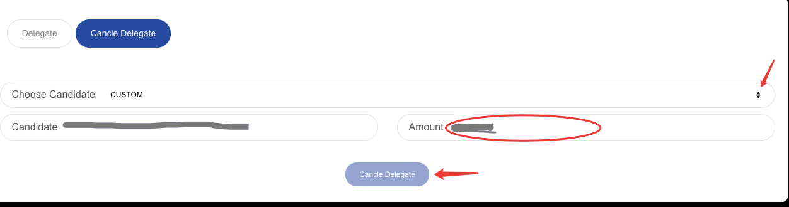

Light Wallet Mode
=================

In light mode, you can transfer PI, deploy contract and delegate on our mainnet.

.. _Create or import account:

========================
Create or import account
========================

.. image:: ../_static/wallet/account.png

| If you don't have an account, click the ‘Wallet--Create’ to create account and set password. The password will only saved on your local computer.
| You can also import account if you already have a keystore file (file name usually start with UTC) or private key.

========================
Transfer PI cross chain
========================

.. image:: ../_static/wallet/trasfercross.png

| You can transfer PI from main chain to child chain or transfer from child chain to main chain.

=========================
Transfer PI on same chain
=========================
You can transfer PI to another address by click ‘Send PI--Submit’. 

.. image:: ../_static/wallet/transfer.png

.. _How to delegate:

===============
How to delegate
===============

Pchain have 12 epochs per year, and in each epoch there are 4 phases.

+------------+--------------------------------------+------------------------------+
| Phase      | Block Number                         | What you can do              | 
+============+======================================+==============================+
| 0% ~ 75%   | start_block ~ vote_start_block - 1   | apply candidates and delegate| 
+------------+--------------------------------------+------------------------------+
| 75% ~ 85%  | vote_start_block ~ vote_end_block    | vote                         |
+------------+--------------------------------------+------------------------------+
| 85% ~ 95%  | reveal_start_block ~ reveal_end_block| reveal vote                  |
+------------+--------------------------------------+------------------------------+
| 95% ~ 100% | reveal_end_block + 1 ~ end_block     | check next epoch's info      |
+------------+--------------------------------------+------------------------------+

| If you do not want to run node on PCHAIN yourself, you can delegate PI to one / several Validator candidate(s) with PI wallet (Light wallet) during first phase.
| First, choose one chain that you want to delegate tokens. And make sure the minimum balance with 1,000 PI.

.. image:: ../_static/wallet/delegatepage.png

Click ‘Delegate--Recommended Candidates’ and choose one candidate address from this list. Fill the amount with at least 1,000 PI that you want to delegate to this address. Then click ‘Delegate’.

.. image:: ../_static/wallet/clickdelegate.png

After you delegate successfully, you can check your delegate balance here or go to ‘ Fullbalance’.

.. image:: ../_static/wallet/checkdelegate.png

.. _Wallet Cancel Delegation:

========================
How to cancel delegation
========================

You can cancel delegation before the current Epoch reaches 75%.

1) If your candidate is validator in current Epoch, the cancelation will be effective immediately. Your PI will be automatically unlocked to your balance when the current Epoch reaches 100%.

2) If your candidate is not validator in current Epoch, then the cancelation will take effect immediately and your PI will be automatically unlocked to your balance.

| Click ‘Delegate--Chain--Cancel Delegate’.

.. image:: ../_static/wallet/canceldelegate.png

| Choose the candidate that your want to cancel delegation to from the list. The default amount shows the total amount that you delegate to this address. 
| You can cancel with total delegation amount. Also, you can define the amount that you want to decrease but ensure the delegate balance to this address is equal or greater than 1,000 PI.

