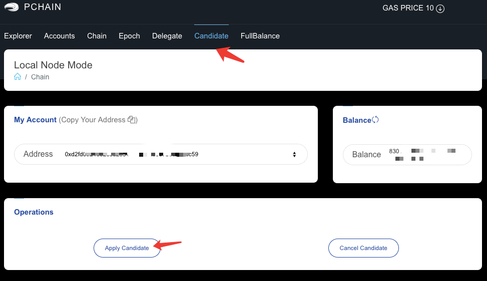
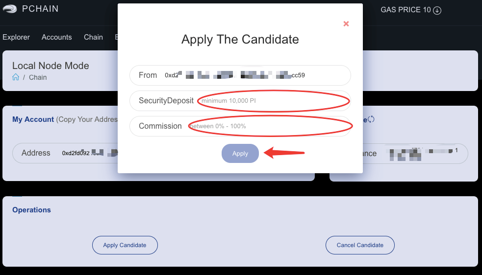
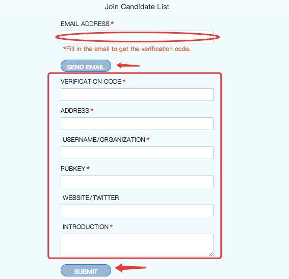
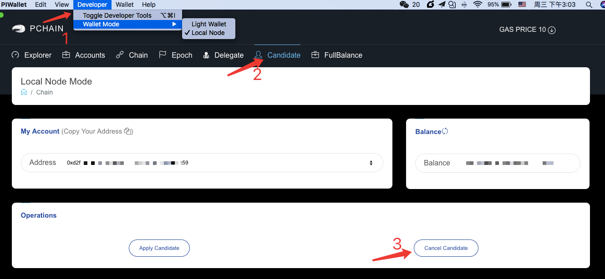
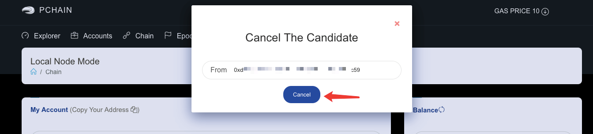

.. _Wallet Candidate:

======================================
How to apply for a Candidate Node
======================================

Before you vote to become validator by PIWallet, make sure you have done things bellow: 

- :ref:`set up the RPC URL <Local Node Mode>` 
- have at least 10k PI on your address for applying the candidate node
- In general, the gas fee is about 0.00021 PI which will be directly paid from your balance.

First, unlock your account. (Please do not keep your account unlock for long time, we recommand set the 'unlockDuration' to 300. If you set it to 0, your account will unlock forever unless you lock it manually)

.. image:: ../../_static/wallet/localnode/unlock.png

Click ‘Candidate--Apply Candidate’ and fill your deposit amount with at least 10,000 PI and your expected commission(% profit sharing expected from being a Validator). Then click ‘Apply’. Noted: before "apply", ensure there is at least 0.00021 PI left in your address balance for paying the gas fee.

| 

| 

.. image:: ../../_static/wallet/localnode/apply3.png

Go to `Join Candidate List <https://pchain.org/joinCandidate>`_ and submit your introduction. Detailed information increases your chances of convincing Delegators to support your candidacy.

Once your submission has been validated in 2 business days, you will be publicly listed on Recommended Candidates on PIWALLET under Light wallet.

.. image:: ../../_static/wallet/localnode/search.png

Click ‘Delgate--Recommended Candidates’ and click your address from this list. Your information will show under the below.

.. image:: ../../_static/wallet/localnode/showlist.png

If your submission is rejected, PCHAIN team will inform you with email after 2 business days.

.. _Wallet Cancel Candidate:

========================
How to cancel Candidate
========================

Once you apply candidate successfully, you can cancel it via calling for RPC or PCHAIN wallet before the Epoch reaches 75%.

1) Canceling your submission after selected to be Validator: your staked PI will be unlocked and all the delegated tokens you received will be automatically returned to each delegator.once the Epoch reaches 100% height.

2) Canceling your submission after you failed being elected Validator: the cancelation will be effective immediately since there are no Validator duties to be completed, your staked PI will be unlocked, and all the delegated tokens you received automatically returned to each delegator balance. 

Noted: In general, the gas fee is about 0.00021 PI which will be directly paid from your balance.

You can cancel Candidate via PIwallet (Local node )or `call for RPC <https://github.com/pchain-org/pchain/wiki/How-to-Become-a-Candidate>`_ before starting voting for next Epoch Validator.

Click ‘Developer--Wallet Mode--Local Node--Candidate--Cancel Candidate’.

Confirm the candidate address that you want to cancel and click ‘Cancel’.

