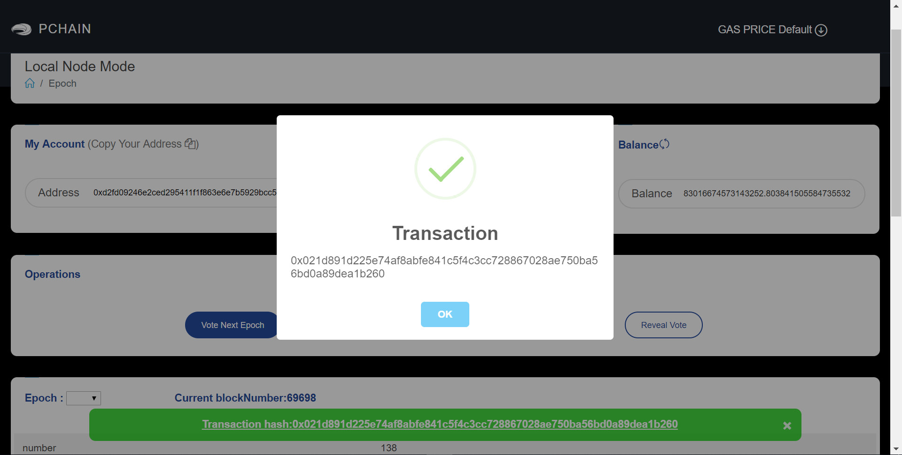

.. _Wallet Validator:

=========================
How to become validator
=========================

Before you vote to become validator by PIWallet, make sure you have done things bellow: 

- :ref:`set up the RPC URL <Local Node Mode>` 
- have at least 100k PI on your address

You can choose to apply candidates first so you can let other delegate to you. This is an option, not neccessity.

Pchain have 12 epochs per year, and in each epoch there are 4 phases.

+------------+--------------------------------------+------------------------------+
| Phase      | Block Number                         | What you can do              | 
+============+======================================+==============================+
| 0% ~ 75%   | start_block ~ vote_start_block - 1   | apply candidates and delegate| 
+------------+--------------------------------------+------------------------------+
| 75% ~ 85%  | vote_start_block ~ vote_end_block    | vote                         |
+------------+--------------------------------------+------------------------------+
| 85% ~ 95%  | reveal_start_block ~ reveal_end_block| reveal vote                  |
+------------+--------------------------------------+------------------------------+
| 95% ~ 100% | reveal_end_block + 1 ~ end_block     | check next epoch's info      |
+------------+--------------------------------------+------------------------------+

You can check current phase in PIWallet **Epoch** page.

Now you can prepare the parameters will used during vote and reveal vote, you should have:

- address 
- consensus public key   //contains in priv_validator.json
- consensus private key  //contains in priv_validator.json
- amount           //should be at least 10k PI and equal or larger than total_depositBalance + total_proxiedBalance
- salt       

First of all, make sure you have bls' key for consensus, thy are included in file `priv_validator.json`. (If you don't have one, follow :ref:`Create Your Account` to generate). Here is an example. 

.. code-block:: json

	{
	        "address": "50CA5341DFE4B07C41854FF79BDB8AB4E11C996D",
	        "consensus_priv_key": [
	                4,
	                "E0F8749A59EEF72347DDB1947A00292BD9D18D32B7C637692B98133A9A9D06D4"
	        ],
	        "consensus_pub_key": [
	                4,
	                "0939AD7B1543A37FB2803325EE6C385424D31E0A6A48B2913F425FE3ACBB56301282406B98C389D2D8DE95BB354ABAEF0C3CE7D4D985BE178B3B889B1859874D77C7EEB09146C1B66106FFB803D2884C0102B62A0FEF02D57B33AC286B41BD1183FDB55C8F25FA29859C4A370C9A19F077AB335D905CAB7E4E097C6BF31D3C5C"
	        ]
	}

----
Vote
----
Click the ‘Epoch--Vote Next Epoch’ and fill the information.

.. image:: ../../_static/wallet/localnode/vote.png

| From: 	the address to receive mining reward 
| PubKey:	bls public key included in priv_validator.json
| Amount: 	the amount(PI) you wanna deposit(must equal or larger than total_depositProxiedBalance+total_proxiedBalance)
| Salt:		can be whatever you want

If you vote successfully, the wallet will return a transaction hash. **Please remember all parameters you set!**

-----------
Reveal Vote
-----------
Click the ‘Epoch--Reveal Vote’ and fill the information

.. image:: ../../_static/wallet/localnode/reveal.png

| From, PubKey, Amount and Salt must be the same with the value you set on vote.
| BLS Private Key: bls private key included in priv_validator.json

If you vote successfully, the wallet will return a transaction hash.

.. image:: ../../_static/wallet/localnode/revealhash.png
