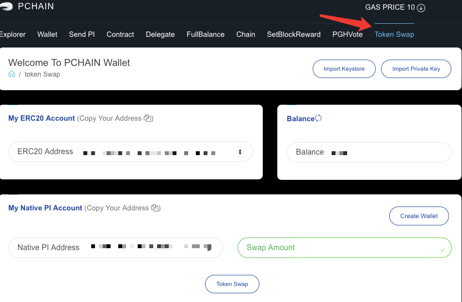
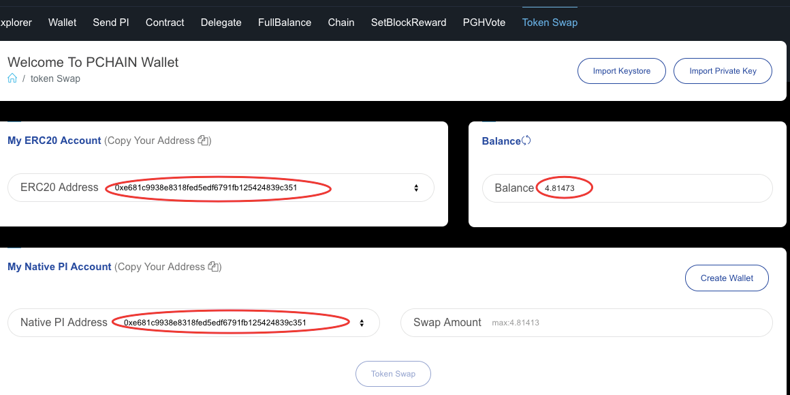
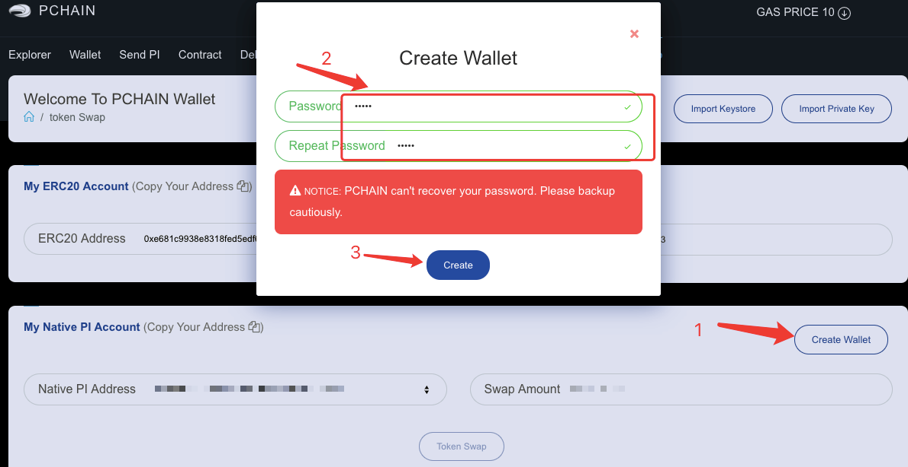
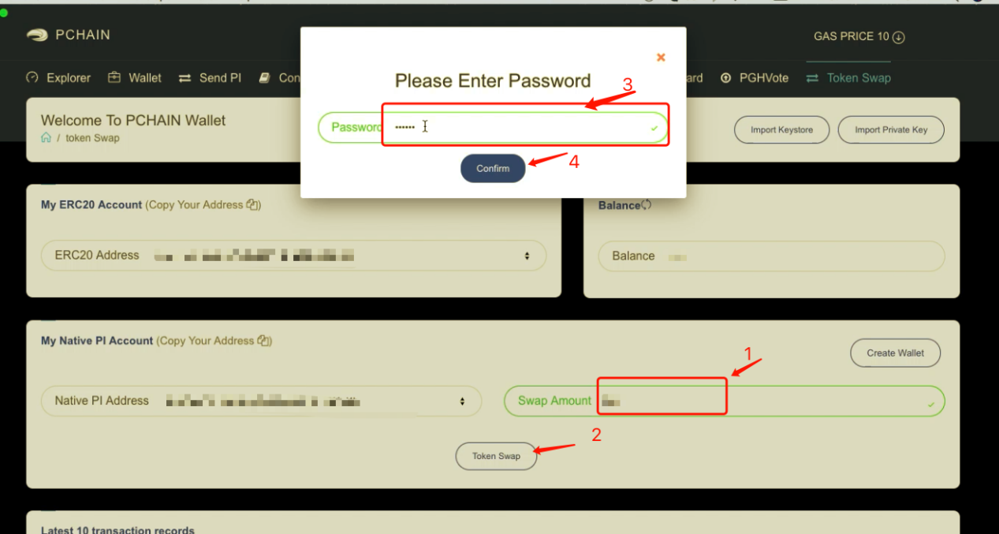
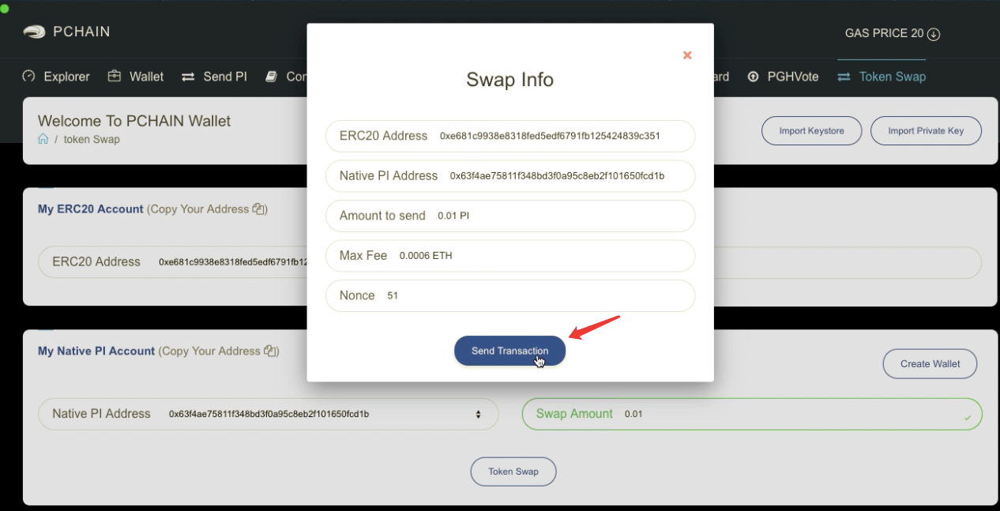
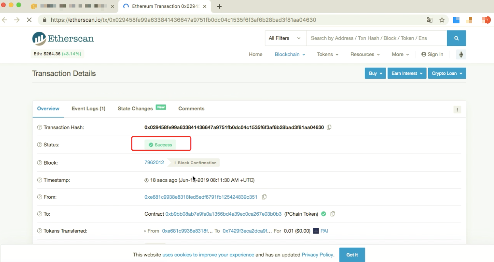
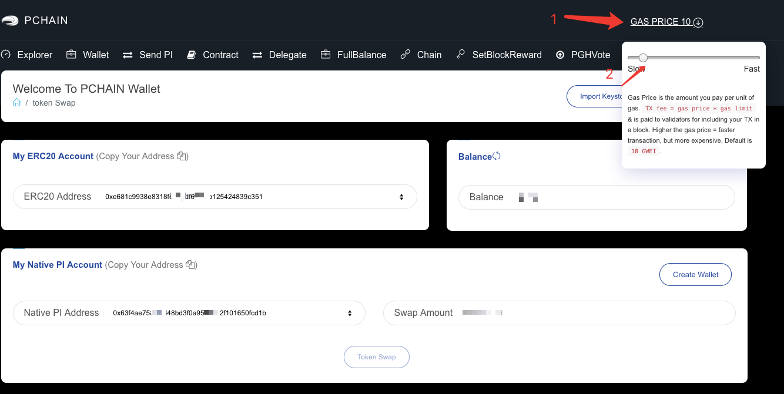
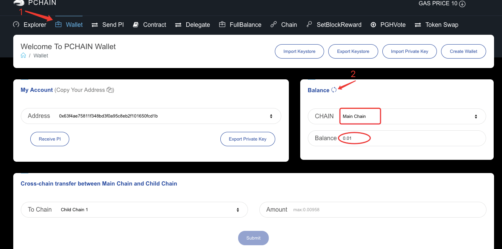

.. _Token Swap zh:

==========
Token Swap
==========

PCHAIN主网PI的映射，可通过官方PIWallet 和交易所这两种方式完成。

目前，支持PCHAIN主网PI的交易所有Coinsuper, Gate.io ,Upbit以及Bithumb，其他交易所如Bibox、Bittrex Global等都支持ERC 20 PI，因此，若您的ERC 20 PI在以上交易所，则您首先需提币。

若您的ERC 20 PI在ERC20钱包中，如MEW、Imtoken或者冷钱包，在使用PIWallet进行映射前，请确认您是否持有该地址的私钥或者keystore文件。若没有，则需要将该地址中的ERC20 PI转移至一个新的ERC20 地址，您可以通过PIWallet 来创建ERC20 地址。（创建ERC 20 地址）

- 映射方式1: 交易所映射
Bithumb 可支持PCHAIN主网映射， 您可将ERC 20 PI充值到Bithumb 账户，就可以自动完成映射了。具体操作您可参考Bithumb 官方指南。
https://support.bithumb.pro/hc/en-us/articles/360033820673-Bithumb-Global-PI-Listing-Jul-31-2019

- 映射方式2: PIwallet 钱包映射
PIwallet 仅支持主网PI，在PIwallet 上创建的地址与ERC 20地址兼容。

在PIwallet上开始映射之前的提醒：

1. 将PCHAIN钱包更新到最新版本1.0.4， 点击 `这里 <https://github.com/pchain-org/wallet/releases>`_ 下载PIwallet
2. 确保您有ERC20 PI地址的私钥或keystore文件
3. 确保ERC20 PI地址中有足够的ETH来支付gas费

第1步：打开PIwallet，然后点击‘Token Swap’

第2步：将您的ERC20 PI地址导入PCHAIN钱包。
	
	方法1：点击‘Import Private Key ’，填写其私钥。 设置密码并重复确认。 然后单击“导入”进行确认。
	
	注意：请自行保管好密码。  

	.. image:: ../../_static/tokenswap/tokenswap1.png

	这里将显示你的ERC20 PI的地址和你的ERC20 PI的余额

	.. image:: ../../_static/tokenswap/tokenswap2.png

	方法2: 点击‘Import Keystore’,从你的电脑选择keystore文件

	.. image:: ../../_static/tokenswap/tokenswap3.png

	.. image:: ../../_static/tokenswap/tokenswap4.png

	输入密码然后点击‘Import’

	.. image:: ../../_static/tokenswap/tokenswap5.png

	然后你将看到ERC20 PI的地址和ERC20 PI的余额

	.. image:: ../../_static/tokenswap/tokenswap6.png

步骤三：确认您的主网PI地址。
下面的默认主网PI地址是导入后的ERC20 PI地址。

如果要使用新地址接收主网PI，请单击“‘Create Wallet’。 设置密码并重复密码。 点击‘Create’进行确认

第4步：填写您要映射的金额。 然后单击‘Token Swap’。
输入密码，然后单击‘Confirm’继续。 请确保您的ERC20 PI地址中有足够的ETH来支付gas费。

确认映射信息，点击‘Send Transaction’.它将自动跳转到Etherscan，请耐心等待交易成功

注意：如果Etherscan页面显示‘pending’状态 或者‘unable to locate this transaction Hash’状态很长时间（例如超过1小时），您可以返回到钱包，填写相同数量和更高的gas费，在nounce 值一致的情况下，您的前一笔交易可能会被这笔交易替换掉。

第5步：点击‘Wallet’检查你的余额

 
